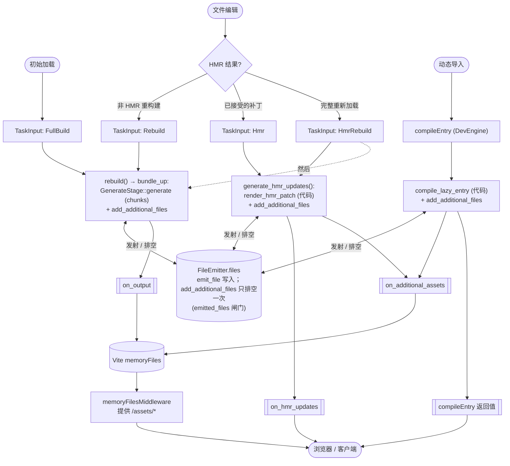

## 6. 从文件系统事件到队列任务 —— `handle_watch_event`

`handle_watch_event`（`bundle_coordinator.rs`）通过共享的 `rolldown_fs_watcher::map_notify_event` 辅助函数，将原始的 `notify` 事件批次转换为 `FxIndexMap<PathBuf, WatcherChangeKind>`（与构建监听使用相同的映射）：

| `notify` `EventKind`                          | `WatcherChangeKind`                          |
| --------------------------------------------- | -------------------------------------------- |
| `Create(_)`                                   | `Create`                                     |
| `Modify(Name(RenameMode::To))`                | `Create`                                     |
| `Modify(Name(RenameMode::Both))`              | `Delete`（`paths[0]`）、`Create`（`paths[1]`） |
| `Modify(Name(RenameMode::From))`、`Remove(_)` | `Delete`                                     |
| `Modify(_)`（其他）                           | `Update`                                     |
| macOS 非轮询模式下的 `Modify(Metadata(_))`    | 忽略（仅 FBM；在映射前跳过）                 |
| `Access(_)`                                   | 忽略                                         |

随后它会调用 `handle_file_changes`。需要注意的是，`rolldown_dev` 不会自行执行防抖，也不会自行合并 Delete+Create——它会将每个原始监听器事件批次直接分派出去。`Name(Both)` 重命名会在映射时拆分为 `Delete`+`Create`；这不是防抖合并。

## 8. `schedule_build_if_stale` —— 弹出、合并、启动

`schedule_build_if_stale`（`bundle_coordinator.rs:303-372`）是从 `queued_tasks` 到正在运行的 `BundlingTask` 的桥梁。它在不同状态下的行为如下：

| 状态                                | 行为                                                                                     |
| ----------------------------------- | ---------------------------------------------------------------------------------------- |
| `Initialized`                       | 记录错误并返回 `None`                                                                    |
| `FullBuildInProgress` / `InProgress` | 构建已在运行——返回现有的 `current_bundling_future`，不进行任何调度                   |
| `Idle` / `FullBuildFailed` / `Failed` | 弹出第一个任务，贪婪地合并后续可合并的任务，然后启动 `BundlingTask`                    |

启动任务时：

1. 弹出第一个 `TaskInput`
2. 当下一个排队任务对当前任务满足 `is_mergeable_with` 时，使用 `merge_with` 将其合并
3. 构造一个 `BundlingTask`
4. 如果 `task_input.requires_full_rebuild()` → 将状态设置为 `FullBuildInProgress`；否则 → 设置为 `InProgress`
5. 使用 `tokio::spawn` 将任务的 `run()` 作为 `Shared` future 启动，并将其存储到 `current_bundling_future` 中

关键不变量：同时最多只有一个 `BundlingTask` 在运行。任务运行期间，协调器处于 `*InProgress` 状态，新的文件变更只会追加到 `queued_tasks`；当前任务完成后才会处理这些变更（见 §11）。

**浏览器刷新——构建之前已经失败。** 协调器处于 `FullBuildFailed` 或 `Failed`。这个失败状态就是最新输出——在没有新的文件变更前，没有更“新”的内容可以提供。`ensure_latest_bundle_output` 返回 `None`。

**从失败的构建中恢复。** 用户修复了代码。watcher 检测到变更并触发 `handle_file_changes`（§7），从而排入新的构建。当用户刷新浏览器时，协调器要么是 `InProgress`（构建仍在运行——`ensure_latest_bundle_output` 会等待它），要么是 `Idle`（构建已完成——输出已新鲜）。之所以能这样工作，是因为即使在构建失败后，`update_watch_paths()` 也会执行（`handle_bundle_completed`，§11），因此已经解析过的文件仍然会被监控。

**边缘情况：从缺失 import 失败中恢复。** 如果初次构建因为缺失 import 而失败，那么缺失的文件从未被解析过，因此不在 `watch_paths` 中。watcher 无法检测到它的创建，所以编辑或创建它不会触发重建。在这种情况下，需要使用 `triggerFullBuild`（见下文）来强制重建。

**`DevEngine::run()` —— 等待初始构建。** `run()` 会调用 `ensure_latest_bundle_output` 来等待第一次 `FullBuild`。协调器处于 `FullBuildInProgress` 状态并返回正在运行的 future。构建结束后——无论成功还是失败——输出都已经尽可能地最新。循环结束，`run()` 返回。

**通过 `triggerFullBuild` 手动重试。** 这是一个独立的、即发即忘的操作，供那些明确希望无论当前状态如何都强制发起新构建的调用方使用（例如开发服务器的重载命令）。`DevEngine::trigger_full_build` 会向协调器发送 `TriggerFullBuild`，协调器会无条件清空 `queued_tasks`、压入一个 `FullBuild`，并调度它。该调用会立即返回，不等待构建完成。需要等待的调用方可以把它和 `ensure_latest_bundle_output` 组合使用——FIFO 通道顺序保证 `FullBuild` 会先于 ensure 消息被调度。

## 14. bundler 侧的增量入口点

`BundlingTask::rebuild` 的调用会落到
`crates/rolldown/src/bundler/impl_bundler_incremental_build.rs`：

```rust
incremental_write(scan_mode)     // → incremental_bundle(true,  scan_mode)
incremental_generate(scan_mode)  // → incremental_bundle(false, scan_mode)
```

`incremental_bundle` 将 `ScanMode` 映射为 `BundleMode`：

```rust
let bundle_mode = match scan_mode {
  ScanMode::Full       => BundleMode::IncrementalFullBuild,
  ScanMode::Partial(_) => BundleMode::IncrementalBuild,
};
```

然后在 `with_cached_bundle` 中执行工作。

### `with_cached_bundle` — 缓存所有权转移

`with_cached_bundle` 将长生命周期缓存移入每次构建的 `Bundle`，
运行构建闭包，然后把缓存移回去：

```rust
async fn with_cached_bundle<T>(
  &mut self,
  bundle_mode: BundleMode,
  with_fn: impl AsyncFnOnce(&mut Bundle) -> BuildResult<T>,
) -> BuildResult<T> {
  let cache = mem::take(&mut self.cache);       // 从 Bundler 中取出
  let mut bundle =
    self.bundle_factory.create_bundle(bundle_mode, Some(cache))?;
  let ret = with_fn(&mut bundle).await?;
  self.cache = bundle.cache;                    // 移回 Bundler
  Ok(ret)
}
```

这里涉及 **两个** 不同的 `ScanStageCache` 实例：

`with_cached_bundle` 是它们之间进行转移的唯一位置。

### `ScanStageCache` 与快照

`ScanStageCache`（`crates/rolldown/src/types/scan_stage_cache.rs`）持有
`snapshot: Option<NormalizedScanStageOutput>`，以及模块索引映射和 barrel 状态。相关方法：

- `set_snapshot(output)` — 存储快照
- `take_snapshot() -> Option<…>` — 移除并返回快照
- `get_snapshot() -> &NormalizedScanStageOutput` — 借用快照
  （文档说明如果尚未设置则会 panic）
- `get_snapshot_mut()` — 可变借用（如果尚未设置则会 panic）
- `merge(...)` — 将增量扫描输出合并到快照中；
  首次调用时会填充快照
- `update_defer_sync_data(...)` — 取出快照，执行
  `defer_sync_scan_data` 工作，然后将快照放回

### HMR 读取 `Bundler::cache`

`impl_bundler_hmr.rs` 在三个调用点从 `&mut self.cache`
（`Bundler::cache`）构建 `HmrStageInput`：

- `compute_hmr_update_for_file_changes` — 文件变更驱动的 HMR
- `compute_update_for_calling_invalidate` — 程序化的 `invalidate()`
- `compile_lazy_entry` — 懒编译入口编译

随后，`HmrStage` 读取缓存中的快照（例如，
`hmr/hmr_stage.rs` 中的 `module_table()` 会调用 `get_snapshot()`）。

---

## 15. `DevEngine` 的其他 API

除了 `ensure_latest_bundle_output` 之外，`DevEngine`
（`dev_engine.rs`）上的公共方法还有：

| 方法                                           | 用途                                                                                         |
| ------------------------------------------------ | ---------------------------------------------------------------------------------------------- |
| `new(config, options)`                           | 构建 `Bundler`，规范化选项，创建 watcher 和协调器                                               |
| `run()`                                          | 生成协调器任务，并通过 `ensure_latest_bundle_output` 等待初始构建                               |
| `trigger_full_build()`                           | 发送 `TriggerFullBuild`（即发即忘；与 `ensure_latest_bundle_output` 组合使用以等待）             |
| `wait_for_close()`                               | 等待协调器的 join handle                                                                       |
| `wait_for_ongoing_bundle()`                      | `GetState`，等待任何正在运行的 future                                                           |
| `get_bundle_state()`                             | `GetState` → `BundleState { last_build_errored, has_stale_output }`                             |
| `invalidate(caller, first_invalidated_by)`       | 锁定 bundler，为每个客户端调用 `compute_update_for_calling_invalidate`                         |
| `compile_lazy_entry(proxy_module_id, client_id)` | 编译懒加载入口；成功后发送 `ModuleChanged`                                                      |
| `close()`                                        | 发送 `Close`，运行 `closeBundle`，等待协调器关闭                                                |
| `is_closed()` / `bundler_options()`              | 访问器                                                                                         |

`ModuleChanged` 的处理（`bundle_coordinator.rs:123-140`）：更新监控
路径，为变更的模块排入一个 `TaskInput::Rebuild`，设置
`has_stale_bundle_output = true`，然后进行调度。

`#[cfg(feature = "testing")]` 方法——
`ensure_task_with_changed_files`、`get_watched_files`、
`create_client_for_testing`——用于让测试 harness 驱动
模拟文件变更并检查协调器状态。

---

## 16. 错误处理

开发引擎面向三类错误受众。明确区分它们很重要，因为它们需要不同的处理方式，同一个 `Result` 不可能同时满足所有受众。错误类别及其交付通道会进一步按受众划分。

### 16a. 三类受众

- **最终用户** — 使用基于 `rolldown_dev` 构建的框架的应用开发者（通常是 Vite）。编写源代码和插件。看到源自自身工作的错误——构建错误、插件失败。
- **绑定消费者** — 集成 `rolldown_dev` 的框架或工具（通常是 Vite）。负责引擎生命周期：构造引擎、调用 `run`、将 HMR 客户端消息路由到 `invalidate`，以及在关闭时调用 `close`。当它在错误的时机调用引擎时看到错误（例如在 `close` 之后调用 `invalidate`、在 `run` 之前调用 `ensure_latest_build_output` 等）。它们负责正确编排调用顺序；我们会暴露这些误用，使其能够发现自身的 bug。
- **我们** — `rolldown_dev` 本身。将不变量违反作为 panic 处理（§16g）。这些是我们发布的 bug；任何用户都无法从中恢复，panic 是让问题显式暴露的正确方式。

错误按受众划分：

- **构建错误** → 最终用户
- **生命周期错误** → 绑定消费者
- **不变量违反** → panic（我们）

#### 构建错误（最终用户）

在 bundler 内部产生的 `BuildResult<T>` / `BatchedBuildDiagnostic`。
错误源自用户代码或插件（resolve、load、transform、插件生命周期钩子）。

示例：

- `Bundler::compute_hmr_update_for_file_changes` — HMR 计算产生的诊断信息，在 `BundlingTask::generate_hmr_updates` 中暴露
- `Bundler::compute_update_for_calling_invalidate` — 程序化 `invalidate()` 路径产生的诊断信息，由 `DevEngine::invalidate` 暴露
- `Bundler::incremental_write` / `incremental_generate` — 重建产生的诊断信息，在 `BundlingTask::rebuild` 中暴露
- `plugin_driver.watch_change` — 插件的
  `watchChange` 钩子产生的 `anyhow::Error`，在
  `BundlingTask::run_inner` 调用点被提升为 `BatchedBuildDiagnostic`

#### 生命周期错误（绑定消费者）

由 `DevEngine` 本身产生，而不是由 bundler 产生的 `BuildResult<T>`。
错误源自引擎的状态机：针对已关闭的引擎调用了方法、协调器的 mpsc 通道在操作期间被丢弃、协调器离开后内部 oneshot 回复未到达。

示例：

- 每个接触协调器的 `DevEngine` 方法顶部的 `create_error_if_closed()?`（`dev_engine.rs`）
- 引擎关闭后，`coordinator_sender.send(...).map_err_to_unhandleable().context(...)?`
- 协调器在响应前关闭时，`reply_receiver.await.map_err_to_unhandleable().context(...)?`

这些由绑定消费者负责——Vite 必须正确编排调用，以免与 `close()` 发生竞争。当竞争确实发生时，默认情况下我们会报告而不是吞掉错误（§16d），这样消费者就能发现并修复顺序 bug。§16d 中列出的等待方法是例外：它们返回 `Ok`，因为“你等待的事情已经不可能发生”就是完整的答案。

这两个类别目前共享 `BuildResult<T>` 类型——不存在静态区分。需要做出不同响应的代码必须先检查 `DevEngine::is_closed()`。

### 16b. 两种交付通道

**抛出（同步 API）** — 接收单个调用方并返回单个结果的公共 napi 方法，在边界上使用 `BindingResult<T> = Either<BindingErrors, T>`，JS 包装器调用 `unwrapBindingResult`，成功时返回结果，否则抛出 `BundleError`。

使用者包括：`invalidate`、`ensureLatestBuildOutput`、`getBundleState`、
`waitForOngoingBundle`。抛出的错误会到达调用该方法的受众：

- `invalidate` 通常由绑定消费者的 HMR 层调用，以响应最终用户的 HMR 客户端消息。抛出的错误会被消费者观察到；是否将其传递给最终用户由消费者决定。
- `ensureLatestBuildOutput` 由消费者的开发服务器中间件在提供请求前调用。消费者负责处理或传递错误。
- `close`、`run` 以及具有生命周期语义的方法从其设计上就是由消费者驱动的。

**回调（异步生命周期）** — 在 `BundlingTask` 内部异步发生的工作，通过引擎构造时注册的 `on_output` / `on_hmr_updates` 回调报告（见 §10）。

使用者包括：`BundlingTask::run_inner` 中产生的每个错误——
`watch_change`、`generate_hmr_updates`、`rebuild`。消费者在引擎创建时订阅一次，并接收每次构建的结果通知。这些回调是构建错误到达最终用户的规范通道（消费者会将错误转发到自身的错误覆盖层 / HMR 错误显示中）。

选择通道的规则：**如果消费者无法提前设置回调（因为错误源自一次性调用），就抛出；否则交付给回调**。

### 16c. `BundlingTask` 内部的错误路由

`run_inner` 有三个会产生错误的阶段。每个阶段负责决定如何路由自身的错误；`run_inner` 本身没有顶层错误处理器。

| 阶段                  | 使用的回调          | 如果已注册回调             | 如果未注册回调       |
| ---------------------- | ------------------- | -------------------------- | -------------------- |
| `watch_change` 钩子    | `on_output`         | 交付，然后提前返回         | 仅记录日志，提前返回 |
| `generate_hmr_updates` | `on_hmr_updates`    | 交付，然后可能继续         | 仅记录日志，可能停止 |
| `rebuild`              | `on_output`         | 交付                       | 仅记录日志           |

阶段失败时会设置对应的阶段标志（`watch_change` / `generate_hmr_updates` 使用 `hmr_errored`，`rebuild` 使用 `rebuild_errored`）。任务结束时，这些标志会合并为 `error_stage: Option<ErrorStage>`（优先级为 `Rebuild > Hmr`，见 §10），并通过 `BundleCompleted { error_stage, .. }` 报告给协调器。无论是否注册了用于接收错误本身的回调，协调器都会使用该信息转换到 `FullBuildFailed` / `Failed { last_error_stage }`（§11）。

`generate_hmr_updates` 返回 `bool`——“后续阶段是否可以继续？”——保留 `BuildResult` 之前的短路行为：只有在 HMR 错误没有可用于暴露错误的回调时，才会跳过 rebuild（与旧的 `?` 传播行为一致）。

`watch_change` 会短路：如果插件的 `watchChange` 钩子失败，则无法安全地继续生成 HMR 或执行 rebuild，因此 `run_inner` 会提前返回。

### 16d. 默认情况下向绑定消费者暴露引擎已关闭错误

生命周期错误（引擎已关闭、协调器已离开、通道已丢弃）会**暴露给绑定消费者**，而不会被静默吞掉。Vite 需要知道自己在 `close` 之后调用了 `invalidate`，这样才能修复调用顺序；吞掉错误会掩盖误用并使其不断扩散。

**按方法划分的例外**：当“无事可做，直接返回”显然符合该方法的语义时，方法可以返回 `Ok` 而不是生命周期错误。该例外适用于：

- 方法执行的是等待 / 观察，而不是请求工作
- “等待的事情已经不可能发生”是完整且诚实的答案
- 抛出错误会迫使消费者围绕正常关闭事件编写没有实际恢复操作的 `try/catch`

目前采用该例外的方法：

- `DevEngine::wait_for_ongoing_bundle`（`dev_engine.rs:144-172`）——等待一个已经不会再发生的进行中构建；返回 `Ok` 在语义上是正确的。该方法的文档注释对此有明确说明。
- `BindingDevEngine::ensure_current_build_finish`（JS 中 `DevEngine.ensureCurrentBuildFinish` 使用的 napi 包装器）——语义相同，PR #9564
- `DevEngine::ensure_latest_bundle_output`——仅针对 `close()` 与已通过入口检查的方法调用发生竞争的情况。该方法确实请求工作，因此入口处仍保留 `create_error_if_closed()`，并且在引擎处于打开状态时仍会暴露通道失败；一旦 `close()` 已开始，它本应等待的输出就不可能再产生。消费者会在页面请求中调用此方法，因此拒绝会成为没有有用恢复方式的未处理拒绝（rolldown#10729）。

其他所有生命周期错误路径都应当暴露。添加新方法时，**默认选择暴露错误**；只有在有明确的语义理由时才采用例外，并在方法上记录原因。

### 16e. 转换路径：`BuildResult` → `BindingResult` → JS

分为三个步骤：

1. **`BuildResult<T>`**（`Result<T, BatchedBuildDiagnostic>`）——bundler 的原生错误类型，在 Rust crate 内部各处使用。`BatchedBuildDiagnostic` 携带一个或多个 `BuildDiagnostic`。

2. **`BindingResult<T>`**（`Either<BindingErrors, T>`，
   `crates/rolldown_binding/src/types/error/mod.rs`）——napi 边界类型。在 `Err` 一侧，每个 `BuildDiagnostic` 都会通过 `to_binding_error(diagnostic, cwd)` 转换为 `BindingError`（`crates/rolldown_binding/src/types/binding_outputs.rs:79`）。`cwd` 是 `DiagnosticOptions` 将路径格式化为相对于项目根目录的路径所必需的。`BindingDevEngine` 存储 `cwd: Arc<Path>`，使结构体方法和两个回调闭包共享同一次分配。

3. **JS 层**（`packages/rolldown/src/utils/error.ts`）——
   `unwrapBindingResult(container)` 成功时返回 `T`，否则抛出聚合各个 `BindingError` 的 `BundleError`。`normalizeBindingResult(container)` 返回 `T | Error` 而不抛出，供没有合适 `throw` 语义的回调使用。

### 16f. 约定

- **不要对 `BuildResult` 或任何消费者可触达的 `Result` 使用 `.expect()` / `.unwrap()`。** panic 会穿过 napi FFI 边界并可能导致 Node 进程崩溃。应使用 `match`，并通过适当的通道进行路由。
- **`create_error_if_closed()` 是入口检查。** 每个接触协调器的 `DevEngine` 方法都必须先执行它。默认情况下，产生的错误会暴露给绑定消费者（§16d）；采用“将其吞掉并返回 `Ok`”例外（§16d）的方法，还必须在每个 `.send(...)` 和 `.recv()` 位置处理调用期间关闭的竞争情况。
- **插件错误对用户可见。** 绝不要静默丢弃它们；它们必须到达 `on_output` 或 `on_hmr_updates`。
- **每个阶段负责自己的交付。** 在 `BundlingTask` 内部，每个阶段函数处理自己的错误交付；`run_inner` 不是集中式错误处理器。
- **`error_stage` 是协调器信号，回调是消费者信号。** 每次错误都会产生两者；阶段驱动状态机，回调通知用户。

### 16g. 何时应当 panic

开发引擎中的并非所有 `Result` 都应被路由。有些 `.expect(...)` /
`.unwrap()` 调用是正确的：它们断言内部不变量——也就是我们自己的代码所保证的属性——panic 暴露的是编程 bug，而不是运行时条件。

规则如下：

- **对不变量违反执行 Panic。** 如果我们自己的状态机逻辑、关闭顺序或消息协议契约正确，该代码路径就不应被触发。如果它被触发，说明我们发布了 bug；panic 会让问题显式暴露，而不是将其吞成一条静默日志。
- **对运行时条件进行路由。** 任何依赖用户代码、插件行为、文件系统状态、网络、与消费者驱动的生命周期事件（例如 `close()`）发生竞争，或依赖输入验证的情况，都应通过 §16b 中的通道进行路由。对于消费者必须能够观察并恢复的情况，panic 会导致 Node 进程崩溃。

做决定时可以使用一个实用测试：_这个错误是否可能由我们 crate 之外的任何因素触发？_ 如果是，就进行路由；如果不是，就执行 panic。

`rolldown_dev` 中现有的 panic 位置是有意为之的，并非敷衍：

- `crates/rolldown_dev/src/watcher_event_handler.rs:10` —
  `coordinator_tx.send(...).expect(...)`。协调器的 mpsc 接收端由协调器任务持有，并且只有在 `Close` 消息到达时才会关闭。文件系统 watcher 无法触发该路径；如果其 `send` 失败，说明我们的关闭顺序有误。
- `crates/rolldown_dev/src/bundling_task.rs:71` — 最终发送 `BundleCompleted` 时采用相同的模式。协调器会等待所有正在进行的 `BundlingTask` 完成后再处理 `Close`（§4），因此按照设计，在执行此发送时接收端必须仍然处于活动状态。
- `crates/rolldown_dev/src/bundle_coordinator.rs:323, 420` —
  `current_bundling_future.clone().unwrap()` 只能在 `*InProgress` 状态下到达，而状态机保证此时为 `Some(_)`。如果此处出现 `None`，说明遗漏了一次状态转换。
- `crates/rolldown_dev/src/dev_engine.rs:117` — 对协调器任务使用 `join_handle.await.unwrap()`。`coordinator::run()` 是内部代码，不应触发 panic；此处出现 `JoinError` 意味着我们在协调器逻辑中引入了 panic，因此应该修复该 panic 本身，而不是掩盖症状。

添加新的 panic 位置时，请在 `.expect(...)` 消息中记录所断言的不变量，以便下一位读者无需通过逆向分析即可理解该契约。

## 17. 资源发射与交付（完整 bundle 模式）

发射出的文件——一个被 JS 导入的图片 / SVG、一个 CSS `url(...)`、一个 `new URL('./x',
import.meta.url)`——在引擎中通过**两个阶段**流转：

1. **发射。** 插件的 `this.emitFile` 调用 `FileEmitter::emit_file`
   （`crates/rolldown_common/src/file_emitter.rs`），它会对源码做哈希、分配一个 `reference_id`、计算最终的哈希文件名，并在 `files` 映射中存储一个 `OutputAsset`。URL 可通过 `get_file_name`
   _立即_ 解析——在完整 bundle 模式下，输出布局是确定的，因此不需要 `renderChunk`（见 Vite 的 `vite:asset` 插件的 bundled-dev 分支）。
2. **排空 + 交付。** `FileEmitter::add_additional_files` 将尚未交付的条目移动到 `Vec<Output>` 中，并在 `emitted_files` 集合中为每个条目标记，确保每个文件都**恰好交付一次**。被排空的输出通过三个回调之一离开。

`add_additional_files` 只会产生两类输出——它只迭代 `files` 和
`prebuilt_chunks` 两个映射，**绝不会迭代 `chunks`**：

- **`Output::Asset`** — 每个 `files` 条目对应一个，也就是所有通过 `emit_file` 发射的内容（`this.emitFile({ type: 'asset', … })`）：JS 导入的图片 / SVG、CSS `url(...)` 目标、`new URL('./x', import.meta.url)`，以及 `import.meta.ROLLUP_FILE_URL_*` —— 这些静态文件最终解析为 `assets/<name>-<hash>.ext`。
- **`Output::Chunk`** — 每个 `prebuilt_chunks` 条目对应一个（`emit_prebuilt_chunk`），即已经渲染好的 chunk，自带 `code` / `map` / `file_name`。

它**不会**产生：

- 已渲染的 JS chunks（入口 / 动态导入 / 共享）——它们来自 `GenerateStage::generate`，并且在 `add_additional_files` 运行前已经在 `output.assets` 中（它只会 _追加_）；
- `emit_file({ type: 'chunk' })` 的输出——这些会进入 `chunks` 映射，并作为 `AddEntryModule` 发送给模块加载器，因此 generate 阶段会把它们渲染成真正的 chunk（`add_additional_files` 从不读取 `chunks`）；
- chunk sourcemap——会与其对应的 chunk 一起在 generate 阶段发出；
- 插件在其 `generateBundle` 钩子中发出的文件——由该钩子添加，而这个钩子运行在 `bundle_up` 中的 `add_additional_files` 之后。

资源的 _bytes_ 总是汇聚到 `FileEmitter` + `add_additional_files`；每次操作中变化的只有交付回调：



如何阅读这张图：

- **资源 bytes**（到 `memoryFiles` 的路径）：每个操作都会写入 `FileEmitter.files`，并通过 `add_additional_files` 排空；输出通过 `on_output`（build / rebuild）或 `on_additional_assets`（HMR patch / lazy）离开。它们最终都汇入消费者的 `memoryFiles`。
- **代码 / patch**（到客户端的路径）：build 和 rebuild 通过 `on_output` 发送 chunk；HMR patch 通过 `on_hmr_updates` 发送；lazy chunk 是 `compileEntry` 的返回值。
- **`HmrRebuild`** 是唯一的分叉：先运行 `generate_hmr_updates()`（→ `on_hmr_updates` + `on_additional_assets`），_然后_ 运行 `rebuild()`（→ `on_output`）。共享的 `emitted_files` 闸门意味着在 HMR 阶段已排空的资源会被后续的 `bundle_up` 跳过。

### 三个交付回调

| 回调                   | 触发来源                                              | 携带内容                                                                 |
| ---------------------- | ----------------------------------------------------- | ----------------------------------------------------------------------- |
| `on_output`            | `rebuild()` → `bundle_up`                             | 完整的 `BundleOutput`（通过 `add_additional_files` 带上 chunks + assets） |
| `on_hmr_updates`       | `generate_hmr_updates()`                              | `Vec<ClientHmrUpdate>` —— 只包含 patch **代码**（`HmrPatch` 不含 assets） |
| `on_additional_assets` | `generate_hmr_updates()` **以及** `compile_lazy_entry()` | `BundleOutput` —— 发射出的 assets + 它们对应的 `add_additional_files` 警告 |

`on_additional_assets` 是修复资源未被服务 bug 的方案（vite#22596 及其 HMR 类比）：纯 HMR patch 和 lazy compile 都不会经过 `on_output`，因此没有这个回调的话，它们发射出的资源将永远到不了消费者。它会在 patch / lazy 代码到达客户端之前触发（在 `generate_hmr_updates` 中，它先于 `on_hmr_updates` 运行；在 `compile_lazy_entry` 中，它先于代码返回），因此服务构建产物的消费者（例如 Vite，把它们写入 `memoryFiles`）可以在浏览器请求资源时就已经提供它。它只携带 `add_additional_files` 产生的内容（`emit_file` 的 assets + prebuilt chunks）——不包括已渲染的 chunks，也不包括在 `generateBundle` 钩子中发射的资源（该钩子不会在 patch 场景中运行）。它是一个 `BundleOutput`，因此和 `on_output` 一样，`add_additional_files` 的警告也会一并传递。

---

## 18. 快速参考 — 概念到文件映射

| 概念                                           | 文件                                                            |
| ---------------------------------------------- | --------------------------------------------------------------- |
| 公共开发 API，协调器启动                       | `crates/rolldown_dev/src/dev_engine.rs`                         |
| 状态机、排队、调度                              | `crates/rolldown_dev/src/bundle_coordinator.rs`                 |
| 一单位构建工作                                 | `crates/rolldown_dev/src/bundling_task.rs`                      |
| 共享上下文                                     | `crates/rolldown_dev/src/dev_context.rs`                        |
| `CoordinatorState` 枚举                        | `crates/rolldown_dev/src/types/coordinator_state.rs`            |
| `TaskInput` 枚举、合并规则                     | `crates/rolldown_dev/src/types/task_input.rs`                   |
| `CoordinatorMsg` 枚举                          | `crates/rolldown_dev/src/types/coordinator_msg.rs`              |
| `ErrorStage` 枚举                              | `crates/rolldown_dev/src/types/error_stage.rs`                  |
| `RebuildStrategy` 枚举                         | `crates/rolldown_dev_common/src/types/rebuild_strategy.rs`      |
| 增量入口、`with_cached_bundle`                 | `crates/rolldown/src/bundler/impl_bundler_incremental_build.rs` |
| HMR 入口                                       | `crates/rolldown/src/bundler/impl_bundler_hmr.rs`               |
| `ScanStageCache`                               | `crates/rolldown/src/types/scan_stage_cache.rs`                 |
| 开发回调、`DevOptions`                         | `crates/rolldown_dev_common/src/types/dev_options.rs`           |
| 资源发出 / 清空（`add_additional_files`）      | `crates/rolldown_common/src/file_emitter.rs`                    |

---

## 相关内容

- [design.md](./design.md) — 开发引擎的设计原则以及此机制所实现的重建 / 错误流约定
- [bundler-data-lifecycle](../bundler-data-lifecycle/implementation.md) — `BundleMode`、
  `Bundle` / `BundleFactory`，以及开发引擎增量构建所经过的 `ScanStageCache` 生命周期
- [rust-bundler](../rust-bundler/implementation.md) — 开发引擎驱动的核心 `Bundler` 结构体与构建生命周期
- [watch-mode](../watch-mode/implementation.md) — `rolldown_watcher`，基于 actor 的 watch 架构；`rolldown_dev` 复用了相同的 actor 模式
- [lazy-compilation](../lazy-compilation/implementation.md) — 懒加载入口编译，通过 `DevEngine::compile_lazy_entry` 和 `ModuleChanged`
  消息触发
- [dev-server-test-harness](../dev-server-test-harness/implementation.md) — 开发服务器的浏览器测试 harness
- `crates/rolldown_dev/` — 开发引擎实现
- `crates/rolldown_dev_common/` — `RebuildStrategy`、开发选项。
