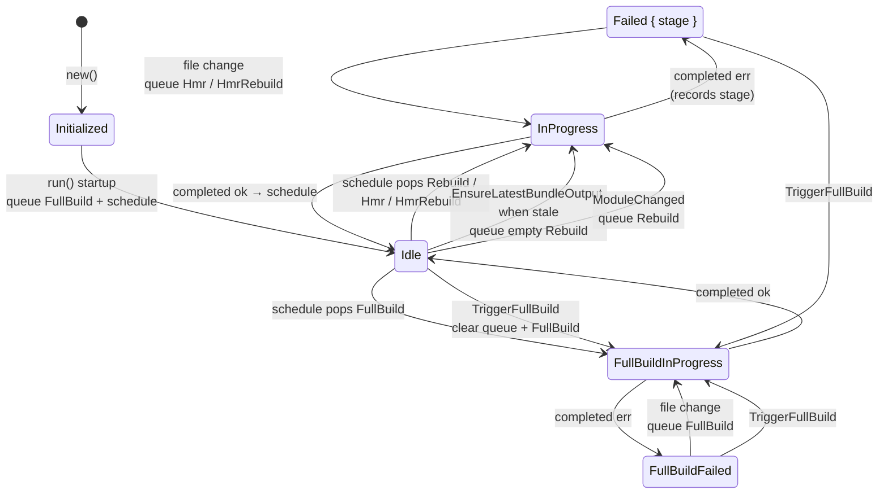

# 开发引擎——实现（`rolldown_dev`，完整打包模式）

> **“为什么”——重建契约、错误流以及四项设计  
> 原则**，它们决定引擎何时重建，见  
> [design.md](./design.md)。本文是实现映射。下文中，“设计原则 N”指 design.md；“§N”指本文中的某一节。

## 概要

开发引擎（`rolldown_dev` 包）是在完整打包模式下，rolldown 的开发模式构建编排层。它位于文件监听器 / 开发服务器与核心 `Bundler` 之间，负责决定要运行 _哪一种_ 构建——HMR 补丁、增量重建，还是完整构建——以及 _何时_ 运行。它的结构是：由一个 `DevEngine`（公开的异步 API 表层）驱动一个单消息循环的 `BundleCoordinator`（一个状态机加工作队列），后者一次只会启动一个 `BundlingTask`。本文是这套机制的结构图：组件分层、`CoordinatorMsg` 协议、`CoordinatorState` 状态机、`TaskInput` 工作类型，以及用于文件编辑、HMR 生成和浏览器页面加载时懒加载完整打包刷新的数据流管线。本文描述的是当前实现的 **事实**，而不是任何特定变更的叙事。

---

## 1. 组件与分层

开发引擎由四个协作部分构成，全部位于 `crates/rolldown_dev/src/`：

```
                    ┌─────────────────────────────────────────┐
                    │              DevEngine                   │
                    │  (dev_engine.rs)                         │
                    │  - 公开的异步 API 表层                   │
                    │  - 持有 Arc<Mutex<Bundler>>              │
                    │  - 持有协调器 mpsc Sender                │
                    │  - 启动协调器任务                        │
                    └───────────────┬─────────────────────────┘
                                    │  CoordinatorMsg (mpsc)
                                    ▼
                    ┌─────────────────────────────────────────┐
                    │           BundleCoordinator              │
                    │  (bundle_coordinator.rs)                 │
                    │  - 单线程消息循环                        │
                    │  - 持有 CoordinatorState                 │
                    │  - 持有 queued_tasks: VecDeque<TaskInput>│
                    │  - 持有文件系统监听器                    │
                    │  - 决定运行什么构建以及何时运行          │
                    └───────────────┬─────────────────────────┘
                                    │  启动
                                    ▼
                    ┌─────────────────────────────────────────┐
                    │             BundlingTask                 │
                    │  (bundling_task.rs)                      │
                    │  - 一个构建工作单元                      │
                    │  - 锁定 Bundler，运行 HMR/重建           │
                    │  - 通过 CoordinatorMsg 回报              │
                    └───────────────┬─────────────────────────┘
                                    │  调用
                                    ▼
                    ┌─────────────────────────────────────────┐
                    │               Bundler                    │
                    │  (crates/rolldown/src/bundler/)          │
                    │  - compute_hmr_update_for_file_changes   │
                    │  - incremental_generate / incremental_  │
                    │    write                                 │
                    └─────────────────────────────────────────┘
```

`DevContext`（`dev_context.rs`）是共享的、近似不可变的粘合层，以 `SharedDevContext = Arc<DevContext>` 的形式在各处传递：

```rust
pub struct DevContext {
  pub options: NormalizedDevOptions,
  pub coordinator_tx: CoordinatorSender,   // 克隆后用于发送消息
  pub clients: SharedClients,              // 已连接的 HMR 客户端
}
```

### 浏览器运行时所有权

HMR 插件会追加 `experimental.devMode.implement`。Rust 层特意不提供默认实现。JavaScript API 在 `crates/rolldown_plugin_hmr/src/runtime/runtime-extra-dev-default.js` 中保留其默认客户端；选项规范化会从其包导出中读取独立的通用运行时，移除其生成的首行辅助导入，并通过包内部的 `#default-runtime` 导入读取默认运行时。随后，它会替换服务器地址并将两者连接起来。Rust 使用者和集成测试框架会显式提供完整实现。

可复用的运行时类也会构建为 ESM 入口 `rolldown/experimental/runtime`；其包导出指向匹配的生成声明文件，因此自定义运行时实现可以从同一个说明符导入值及其类型。该入口从 `crates/rolldown/src/runtime/runtime-base.js` 的未修改副本中导入辅助工具，这与 Rust 核心在生成的 bundle 中包含的源代码相同。移除独立入口生成的辅助导入后，即可恢复逐字不变的通用运行时源代码以供注入，因此生成的 bundle 输出不会发生变化。

### 线程模型

- `BundleCoordinator` 运行在 **一个** 专用的 tokio 任务中（`DevEngine::run` 会执行 `tokio::spawn(coordinator.run())`，`dev_engine.rs:115`）。它的 `run()` 是一个单一的 `while let Some(msg) = self.rx.recv().await` 循环，因此所有协调器状态的变更都是串行的——`CoordinatorState` 上没有锁，这个消息循环 _就是_ 锁。
- 每个 `BundlingTask` 都运行在它 **自己的** 已启动任务中。协调器会持有当前正在运行任务的 `Shared` future 句柄（`current_bundling_future`）。
- `Bundler` 通过 `Arc<Mutex<Bundler>>` 共享。`BundlingTask` 会在其 HMR / 重建工作期间持有它的锁。
- 通信通过 **无界** mpsc 通道完成（`unbounded_channel::<CoordinatorMsg>()`，`dev_engine.rs:62`）。请求 / 响应消息会携带一个 `tokio::sync::oneshot` 回复通道。

## 2. 消息协议 —— `CoordinatorMsg`

定义于 `types/coordinator_msg.rs`。与协调器的每一次交互都是以下消息之一：

```rust
pub enum CoordinatorMsg {
  WatchEvent(FsEventResult),                 // 原始文件监听器事件批次
  BundleCompleted {                          // 一个 BundlingTask 已完成
    error_stage: Option<ErrorStage>,         // 成功时为 None；见 §10
    has_generated_bundle_output: bool,
  },
  ScheduleBuildIfStale { reply: … },         // 请求协调器清空其队列
  GetState { reply: … },                     // 协调器状态快照
  EnsureLatestBundleOutput { reply: … },     // “我需要一个最新的完整打包产物”
  TriggerFullBuild,                          // 无条件完整构建（发出即不管）
  GetWatchedFiles { reply: … },              // 监听路径列表
  ModuleChanged { module_id: String },       // 以编程方式触发的模块变更
  Close,                                     // 关闭协调器
}
```

路由发生在 `BundleCoordinator::run` 中（`bundle_coordinator.rs:98-150`）：

| 消息                       | 处理器                                      |
| -------------------------- | -------------------------------------------- |
| `WatchEvent`               | `handle_watch_event` → `handle_file_changes` |
| `BundleCompleted`          | `handle_bundle_completed`                    |
| `ScheduleBuildIfStale`     | `schedule_build_if_stale`，回复结果          |
| `GetState`                 | `create_state_snapshot`，回复                |
| `EnsureLatestBundleOutput` | `ensure_latest_bundle_output`，回复          |
| `TriggerFullBuild`         | `trigger_full_build`（无回复）               |
| `GetWatchedFiles`          | 回复 `watched_files` 集合                    |
| `ModuleChanged`            | 将一个 `Rebuild` 入队，并调度                |
| `Close`                    | 等待运行中的任务，然后 `break` 跳出循环      |

消息的发送方：

- **文件监听器** 发送 `WatchEvent`。监听器事件处理器由 `BundleCoordinator::create_watcher_event_handler` 创建，并连接到同一个 `coordinator_tx`。
- 已完成的 **`BundlingTask`** 会在其 `run()` 中发送 `BundleCompleted`（`bundling_task.rs:75-80`）。
- **`DevEngine`** 会代表其公开 API 的调用者（开发服务器、HTTP 中间件、懒编译端点等）发送 `ScheduleBuildIfStale`、`GetState`、`EnsureLatestBundleOutput`、`GetWatchedFiles`、`ModuleChanged`、`Close`。

---

## 3. `CoordinatorState` —— 调度器状态机

定义于 `types/coordinator_state.rs`：

```rust
pub enum CoordinatorState {
  Initialized,
  Idle,
  FullBuildInProgress,
  FullBuildFailed,
  InProgress,
  Failed { last_error_stage: ErrorStage },
}
```

它是 `BundleCoordinator` 上的一个 `Copy` 枚举字段，只能通过 `set_initial_build_state`（`bundle_coordinator.rs:445`）进行修改。它以 `Idle` 为分界，分成两半：

- **初次完整构建阶段** —— `Initialized`、`FullBuildInProgress`、`FullBuildFailed`。关注第一次构建。
- **稳态阶段** —— `Idle`、`InProgress`、`Failed`。关注首次构建成功之后的每一次构建。

### 状态含义

| State                         | 含义                                                                                        |
| ----------------------------- | ------------------------------------------------------------------------------------------- |
| `Initialized`                 | 已构造但尚未进入 `run()`。短暂状态。                                                        |
| `FullBuildInProgress`         | 正在运行初始的 `TaskInput::FullBuild`。                                                     |
| `FullBuildFailed`             | 初始完整构建出错。此时完全没有可用输出。                                                    |
| `Idle`                        | 没有构建在运行；上一次构建（如果有）成功了。                                                |
| `InProgress`                  | 正在运行一个增量任务（`Hmr` / `HmrRebuild` / `Rebuild`）。                                 |
| `Failed { last_error_stage }` | 上一次增量任务出错；`last_error_stage` 记录是哪个阶段产生的错误（§7）。                     |

### 状态转移图

边按照驱动它们的机制分组：**调度**（队列中的任务开始执行）、**完成**（`BundleCompleted`）、**文件变更恢复**，以及**重建触发器**（在没有文件变更时也会入队的工作：基于访问的 `EnsureLatestBundleOutput`、程序化的 `ModuleChanged`、手动的 `TriggerFullBuild`）。每个重建触发器都会先入队一个任务，然后调用 `schedule_build_if_stale`，这才是真正修改状态的位置（§8）——因此当构建已经在运行时，触发器只会把任务追加到队列中；等当前任务完成、队列清空时，转移才会发生。



### 每个转移发生的位置

这些是 `set_initial_build_state` 的调用点——唯一的状态修改点，也是观察每次转移的便利位置。

| 转移                                                           | 位置                                           |
| -------------------------------------------------------------- | ---------------------------------------------- |
| `Initialized → Idle`                                           | `run()` 启动，`bundle_coordinator.rs:84-87`    |
| `Idle/Failed/FullBuildFailed → FullBuildInProgress` / `InProgress` | `schedule_build_if_stale`，`:378-380`          |
| `FullBuildInProgress → FullBuildFailed`                        | `handle_bundle_completed`，`:286`              |
| `FullBuildInProgress → Idle`                                   | `handle_bundle_completed`，`:291`              |
| `InProgress → Failed { last_error_stage }`                     | `handle_bundle_completed`，`:311`              |
| `InProgress → Idle`                                            | `handle_bundle_completed`，`:316`              |

### 什么会入队一次重建

下面每一种都会入队一个 `TaskInput` 并调用 `schedule_build_if_stale`；真正的状态修改发生在上面的 `schedule_build_if_stale` 行。它们是构建被启动的不同方式——文件变更只是其中之一。

| 触发器                                                     | 入队内容                       | 结果状态              | 位置                                                |
| ---------------------------------------------------------- | ------------------------------ | --------------------- | --------------------------------------------------- |
| 文件变更，稳态（`Idle` / `InProgress` / `Failed`）        | `Hmr` 或 `HmrRebuild`          | `InProgress`          | `handle_file_changes`，`:202`                       |
| 文件变更，`FullBuildFailed`                                | `FullBuild`（清空暂存）        | `FullBuildInProgress` | `handle_file_changes`，`:248`                       |
| 浏览器访问且已过期（`EnsureLatestBundleOutput`）            | 空文件的 `Rebuild`             | `InProgress`          | `ensure_latest_bundle_output`，`:401`（push `:419`） |
| 程序化模块变更（`ModuleChanged`）                          | `Rebuild`                      | `InProgress`          | run 循环，`:128-145`                                |
| 手动完整构建（`TriggerFullBuild`）                         | 清空队列，`FullBuild`          | `FullBuildInProgress` | `trigger_full_build`，`:457`                        |

## 5. `TaskInput` —— 队列中工作的单位

定义于 `types/task_input.rs`。协调器的工作队列为 `queued_tasks: VecDeque<TaskInput>`。

```rust
pub enum TaskInput {
  FullBuild,                              // 完整构建（初始或恢复）
  Rebuild     { changed_files: … },       // 增量重建，不生成 HMR 补丁
  Hmr         { changed_files: … },       // 仅 HMR 补丁，不重建
  HmrRebuild  { changed_files: … },       // HMR 补丁 和 增量重建
}
```

### 谓词

```rust
requires_full_rebuild()      // 仅对 FullBuild 返回 true
requires_rebuild()           // 对 FullBuild | Rebuild | HmrRebuild 返回 true
require_generate_hmr_update()// 对 Hmr | HmrRebuild 返回 true
```

这些谓词决定打包任务的行为（见 §8）以及协调器的状态选择（见 §7）。

### 可合并性 —— `is_mergeable_with` / `merge_with`

当协调器弹出一个任务时，它会贪婪地将队列前端相邻且兼容的任务合并。规则如下：

| 第一个任务     | 可与之合并的任务        | 结果                                            |
| ------------- | ---------------------- | ----------------------------------------------- |
| `FullBuild`   | 任何任务               | 保持为 `FullBuild`（吸收一切）                  |
| `Rebuild`     | 仅 `Rebuild`           | `Rebuild`，并合并 `changed_files`               |
| `Hmr`         | `Hmr` 或 `HmrRebuild`  | 合并文件；`Hmr+HmrRebuild` → `HmrRebuild`      |
| `HmrRebuild`  | `Hmr` 或 `HmrRebuild`  | `HmrRebuild`，并合并 `changed_files`           |

`Rebuild` 与 `Hmr`/`HmrRebuild` **不能**相互合并——增量重建任务会带入不适合用于生成 HMR 的文件，因此必须保持分离。`FullBuild` 吸收一切意味着，如果存在一个 `FullBuild`，任何一波任务类型都会收敛为单个 `FullBuild`。

---

## 6. 从文件系统事件到队列任务 —— `handle_watch_event`

`handle_watch_event` (`bundle_coordinator.rs:154-194`) 将原始的 `notify` 事件批次转换为 `FxIndexMap<PathBuf, WatcherChangeKind>`：

| `notify` `EventKind`                          | `WatcherChangeKind` |
| --------------------------------------------- | ------------------- |
| `Create(_)`                                   | `Create`            |
| `Modify(Name(RenameMode::From))`、`Remove(_)` | `Delete`            |
| `Modify(_)`（其他）                           | `Update`            |
| `Modify(Metadata(_))`（macOS 非轮询模式）     | 忽略                |

然后它调用 `handle_file_changes`。注意，`rolldown_dev` 自身并不做防抖，也不做 Delete+Create 合并——它会将每个原始监视器事件批次直接向下分发。

## 7. `handle_file_changes` —— 按状态进行队列化

`handle_file_changes` (`bundle_coordinator.rs:197-237`) 根据当前状态决定文件变更会变成什么 `TaskInput`：

```
状态                                  → 操作
─────────────────────────────────────────────────────────────────
FullBuildInProgress                   → 将文件暂存到
                                        queued_file_changes_waited_
                                        for_full_build（不入队任务）
Idle | InProgress                     → 入队 Hmr（或在
                                        rebuild_strategy == Always 时入队
                                        HmrRebuild），然后调用
                                        schedule_build_if_stale()
Failed { last_error_stage: Hmr }      → 入队 Hmr（或在
                                        rebuild_strategy == Always 时入队
                                        HmrRebuild），然后调用
                                        schedule_build_if_stale()
Failed { last_error_stage: Rebuild }  → 入队 HmrRebuild
                                        （无条件——Rebuild 阶段的失败
                                        必须进行重建），然后调用
                                        schedule_build_if_stale()
FullBuildFailed                       → 清除 queued_file_changes，
                                        入队 TaskInput::FullBuild，
                                        然后调用 schedule_build_if_stale()
Initialized                           → 记录错误日志，忽略
```

说明：

- 在 `FullBuildInProgress` 期间，文件变更不会被转成任务；
  它们会被暂存，并在完整构建成功后回放
  (`handle_bundle_completed` `:269-273` 会用
  已取出的集合再次调用 `handle_file_changes`)。
- `Idle` 和 `InProgress` 的行为完全一致——都会入队 `Hmr`
  （在 `Always` 下则为 `HmrRebuild`）。
- `Failed` 会根据 `last_error_stage` 区分。`Hmr` 阶段失败
  通过重新执行相同的 Hmr 任务来恢复（`watch_change` 钩子和
  HMR 计算会获得第二次机会）。`Rebuild` 阶段失败会使 bundle
  输出相对于源码过时，因此恢复任务必须包含重建——无论
  `rebuild_strategy` 是什么，都必须是 `HmrRebuild`。
  这实现了 [design.md](./design.md) 原则 3 的推论。
- `Hmr` 与 `HmrRebuild` 的 `Always` / 非 `Always` 选择由
  `rebuild_strategy` 选项决定（见 §9）。只有 `Idle`、`InProgress`
  和 `Failed { Hmr }` 分支会遵守它；`Failed { Rebuild }` 会覆盖它。
- `FullBuildFailed` 是唯一一个在处理文件变更时会入队
  `FullBuild` 的状态。由于完整重建在构造上覆盖所有阶段，因此不需要阶段追踪。

---

## 8. `schedule_build_if_stale` — Pop, Merge, Start

`schedule_build_if_stale` (`bundle_coordinator.rs:303-372`) is the bridge from `queued_tasks` to a running `BundlingTask`. Its behavior by state is as follows:

| State                               | Behavior                                                                                     |
| ----------------------------------- | --------------------------------------------------------------------------------------------- |
| `Initialized`                       | Log an error and return `None`                                                                |
| `FullBuildInProgress` / `InProgress` | A build is already running—return the existing `current_bundling_future` without scheduling anything |
| `Idle` / `FullBuildFailed` / `Failed` | Pop the first task, greedily merge subsequent mergeable tasks, and start a `BundlingTask`    |

When starting a task:

1. Pop the first `TaskInput`.
2. While the next queued task `is_mergeable_with` it, merge it using `merge_with`.
3. Construct a `BundlingTask`.
4. If `task_input.requires_full_rebuild()` → set the state to `FullBuildInProgress`; otherwise → set it to `InProgress`.
5. Use `tokio::spawn` to start the task's `run()` as a `Shared` future and store it in `current_bundling_future`.

Key invariant: at most one `BundlingTask` runs at a time. While a task is running, the coordinator is in a `*InProgress` state, and new file changes are only appended to `queued_tasks`; they will be processed after the current task finishes (see §11).

---

## 9. `RebuildStrategy` 与 `Hmr → HmrRebuild` 升级

`RebuildStrategy` (`crates/rolldown_dev_common/src/types/rebuild_strategy.rs`)：

```rust
pub enum RebuildStrategy {
  Always,   // 在 HMR 之后始终发起增量重建
  Auto,     //（默认）仅当 HMR 更新包含完整重载时才重建
  Never,    // HMR 之后绝不重建
}
```

它会在**两个**地方影响开发引擎：

### 9a. 在队列阶段（`handle_file_changes`）

```rust
let task_input = if rebuild_strategy.is_always() {
  TaskInput::HmrRebuild { changed_files }   // Always
} else {
  TaskInput::Hmr { changed_files }          // Auto 或 Never
};
```

`Always` 会预先承诺执行重建。`Auto` 和 `Never` 会入队一个仅 HMR 的任务。

### 9b. 在运行时（`bundling_task.rs:104-114`）——自动升级

在生成 HMR 之后，打包任务可能会**重写自己的输入**：

```rust
if rebuild_strategy.is_auto()
  && has_full_reload_update         // 生成的 HMR 更新是完整重载
  && !self.input.requires_rebuild() // 输入原本是纯 Hmr
{
  self.input = TaskInput::HmrRebuild { changed_files: … };
}
```

原因是：一次变更究竟是可以热替换，还是需要整页重载，只有在计算出 HMR 差异之后才能知道。所以在 `Auto` 模式下，协调器先入队一个开销较低的 `Hmr`，任务计算 HMR 差异，然后 _如果_ 差异结果表明需要完整重载，任务就把自己升级为 `HmrRebuild` 并执行重建。`Always` 通过始终重建来跳过这一步延迟；`Never` 则在运行时从不重建。

结果：协调器入队的 `TaskInput` 变体并不一定就是实际运行的变体。一个由协调器入队的 `Hmr` 可以在任务执行过程中变成 `HmrRebuild`。

---

## 10. `BundlingTask` —— 执行一个工作单元

`BundlingTask::run` (`bundling_task.rs:58-81`) 调用 `run_inner`，然后
向协调器发送 `BundleCompleted`，其中包含两个字段：

- `error_stage: Option<ErrorStage>` — 成功时为 `None`；出错时，标识错误发生在哪个阶段。
- `has_generated_bundle_output: bool` — 等于 `has_rebuild_happen`，
  也就是任务是否实际上执行了重建。

### 阶段分类

`BundlingTask` 在 `run_inner`
（`hmr_errored`、`rebuild_errored`）中跟踪两个彼此独立的标志，并通过优先级 **`Rebuild > Hmr`** 推导报告用的 `Option<ErrorStage>`：

| `rebuild_errored` | `hmr_errored` | 报告的 `error_stage` |
| ----------------- | ------------- | -------------------- |
| `true`            | 任意          | `Some(Rebuild)`       |
| `false`           | `true`        | `Some(Hmr)`           |
| `false`           | `false`       | `None`                |

`Rebuild` 优先是因为自动升级路径（§9b）：一个 `Hmr` 任务可以在执行中途被重写为 `HmrRebuild`，然后在重建阶段失败。在这种情况下两个标志都会被置位；报告 `Rebuild` 是保守的——下一次文件变更会强制重建，而这正是确认修复所需的行为。

置位位置：

| `run_inner` 位置                          | 置位标志          |
| ----------------------------------------- | ----------------- |
| `plugin_driver.watch_change` 钩子失败     | `hmr_errored`     |
| `generate_hmr_updates` 失败               | `hmr_errored`     |
| `rebuild()`（`incremental_*`）失败         | `rebuild_errored` |

`watch_change` 失败被归类为 `Hmr`，因为下一次 `Hmr` 任务会针对新的变更文件重新运行该钩子——这样足以重试，无需强制重建。

`run_inner` (`bundling_task.rs:83-122`) 按顺序执行：

1. **`watchChange` 插件钩子** —— 对每个变更文件，在最后一个 bundle handle 上调用 `plugin_driver.watch_change`。
2. **HMR 生成** —— 如果 `require_generate_hmr_update()`，则调用 `generate_hmr_updates`，它会设置 `has_full_reload_update`。
3. **自动升级** —— 见 §9b 的 `Hmr → HmrRebuild` 重写。
4. **重建** —— 如果 `requires_rebuild()`，则将 `has_rebuild_happen = true` 并调用 `rebuild()`。

### `generate_hmr_updates` (`bundling_task.rs:124-186`)

- 锁定 `Bundler`。
- 从 `dev_context.clients` 中为每个已连接客户端收集 `ClientHmrInput`。
- 调用 `bundler.compute_hmr_update_for_file_changes(...)`。
- 扫描生成的更新；如果任何一个 `is_full_reload()`，则设置 `has_full_reload_update = true`。
- 出错时，设置 `self.hmr_errored = true`。
- 如果配置了 `on_hmr_updates` 回调，则调用它。

### `compute_hmr_update_for_file_changes` 内部 (`hmr_stage.rs`)

对每个变更文件：

1. **默认受影响集合** — 文件自身的模块，以及每个通过 `addWatchFile` 注册该文件的模块
   （转换依赖），按稳定顺序排列：先是自身模块，然后是按稳定 id 排序的注册者。
2. **`hotUpdate` 插件链**（仅开发模式）—— 插件按钩子顺序运行；
   每个都可以替换该集合。模块 id 在跨越钩子时会按 slash 规范化，
   与 `file` 保持相同约定；返回的带有原生分隔符的 id 仍然可以往返转换。
   空返回会抑制该文件的更新。图中不认识的 id 会被丢弃。懒编译代理和运行时模块在双向上都对该钩子隐藏。
   钩子出错会使整个批次失败：更新报错，且该批次中的任何编辑都不会进入图中。
   与失败的扫描不同，`pending_rescans` 中不会排队任何内容，因此丢失的编辑只有在后续变更再次触及这些文件时才会重新进入图中——这与 `watchChange` 的契约相同。
3. **删除处理** — 已删除的模块无法被重新获取；更新会从其导入者开始。

然后，在整个批次的所有文件之间：

4. **失败扫描重试折叠** — 之前失败扫描排队的文件会在空的早返回之前被加入，因此一个抑制性的钩子无法阻止错误恢复。
5. **抑制未变化输出** — 重新渲染后的输出与重建前的渲染在字节上完全相同的模块会从更新中移除。但有两类例外仍会发送：构建出错后的所有内容（恢复必须到达停留在 overlay 上的客户端），以及 `hotUpdate` 钩子显式返回的模块（变化可能发生在模块自身代码之外，因此相同输出并不能说明任何问题）。
6. **重新获取并打补丁** — 一次部分扫描和缓存合并，然后通过每个客户端的更新超集遍历，挑选要发送的工厂。

### `rebuild` (`bundling_task.rs:189-223`)

- 锁定 `Bundler`。
- 选择扫描模式：
  ```rust
  let scan_mode = if self.input.requires_full_rebuild() {
    ScanMode::Full
  } else {
    ScanMode::Partial(<changed file paths>)
  };
  ```
- 如果 `skip_write` 为 `false`，则调用 `bundler.incremental_write(scan_mode)`；否则调用 `bundler.incremental_generate(scan_mode)`。
- 出错时，设置 `self.rebuild_errored = true`。
- 如果配置了 `on_output` 回调，则调用它。

只有 `TaskInput::FullBuild` 会产生 `ScanMode::Full`。其他所有重建任务（`Rebuild`、`HmrRebuild`）都会产生 `ScanMode::Partial`。

## 11. `handle_bundle_completed` — 任务收尾

`handle_bundle_completed`（`bundle_coordinator.rs:240-299`）处理
`BundleCompleted` 消息。两个相关分支：

### `FullBuildInProgress`

```rust
current_bundling_future = None;
update_watch_paths();                       // 即使失败也会执行
if error_stage.is_some() {
  // FullBuildFailed 总是在下一次文件变更时通过 FullBuild 恢复，
  // 所以这里会丢弃最初的阶段信息。
  state = FullBuildFailed;
  has_stale_bundle_output = true;
} else {
  has_stale_bundle_output = false;
  state = Idle;
  // 重放在完整构建期间暂存的文件变更
  if !queued_file_changes_waited_for_full_build.is_empty() {
    handle_file_changes(drained_changes);
  }
}
// 这里不调用 schedule_build_if_stale——失败时我们等待外部触发；
// 成功时排队的变更已经处理完了。
```

### `InProgress`

```rust
current_bundling_future = None;
update_watch_paths();                       // 注册刚刚拉入的新文件
if let Some(stage) = error_stage {
  state = Failed { last_error_stage: stage };
  has_stale_bundle_output = true;
} else {
  has_stale_bundle_output = !has_generated_bundle_output;
  state = Idle;
}
schedule_build_if_stale();                  // 始终调用——清空队列
```

带入 `Failed` 的阶段就是 `BundleCompleted` 报告的阶段（§10 的优先级）。它会在下一次文件变更时由 §7 读取，用来在 `Hmr` 和 `HmrRebuild` 之间做选择。

关键事实：

- 任何出错的构建之后，`has_stale_bundle_output` 都会变成 `true`，以及
  成功但**没有**重新构建的任务之后（也就是仅 `Hmr` 任务：
  `has_generated_bundle_output == false`）。
- 成功并且完成了重新构建的任务之后（`Rebuild`、`HmrRebuild`、`FullBuild`），
  `has_stale_bundle_output` 会变成 `false`。
- `InProgress` 分支之后总是调用 `schedule_build_if_stale`，
  无论成功还是失败，因此工作队列会持续被清空。

---

## 12. `has_stale_bundle_output` — 新鲜度标志

`BundleCoordinator` 上的一个 `bool`。语义：磁盘/内存中的完整 bundle
输出可能无法反映最新源码。

| 事件                                                  | `has_stale_bundle_output` 变为 |
| ----------------------------------------------------- | ------------------------------ |
| 构造                                                   | `true`                         |
| 成功的 `FullBuild`                                     | `false`                        |
| 失败的 `FullBuild`                                     | `true`                         |
| 成功且完成了重新构建的任务（`Rebuild`/`HmrRebuild`）  | `false`                        |
| 成功的仅 `Hmr` 任务（未重新构建）                      | `true`                         |
| 失败的增量任务                                         | `true`                         |
| 收到 `ModuleChanged`                                   | `true`                         |

`ensure_latest_bundle_output`（§13）会消费它，以决定在提供完整 bundle 之前
是否需要进行惰性重新构建。它也会反映到 `CoordinatorStateSnapshot.has_stale_output`
以及 `BundleState.has_stale_output` 中。

### 伴随项：`last_build_errored`

快照还暴露 `last_build_errored: bool` — 当协调器处于任何错误状态时为 `true`（`FullBuildFailed` 或 `Failed { .. }`）。
这是绑定消费者在决定是否触发访问时再生时应与
`has_stale_output` 配对使用的谓词：带有新鲜度问题且处于错误状态的 bundle
绝不能在访问时重新生成（[design.md](./design.md) 原则 1），因为引擎会将该请求置空，而消费者中天真的“promise resolved ⇒ build fresh”理解会导致虚假的重载循环。它同时覆盖初始构建失败
（`FullBuildFailed`）和增量失败（`Failed { .. }`）——更狭窄的仅初始失败谓词已被移除，因为它是冗余的。

### 伴随项：`last_error_stage`

快照还会暴露 `last_error_stage: Option<ErrorStage>` — 仅在 `Failed { last_error_stage }` 中为 `Some`，携带最近一次增量失败的阶段（§10）。在成功路径以及 `FullBuildFailed` 时它为 `None`（完整构建覆盖所有阶段，因此没有单一的起始阶段——请改用 `last_build_errored` 来检测该情况）。
它会流经 `BundleState.last_error_stage` 和 `BindingBundleState.last_error_stage`（JS 侧的 `'Hmr' | 'Rebuild'` 字符串联合类型）。

`Some(Hmr)` 使得可以有意地对 [design.md](./design.md) 原则 3
（“文件变更是唯一的恢复触发器”）进行**例外**，这一例外限定在消费者侧而不是 rolldown_dev 内部：因为 HMR 生成本身也可能有 bug，消费者可以在页面加载时，当 `last_build_errored && last_error_stage
== Hmr` 时，在 `ensure_latest_bundle_output` 之前调用 `trigger_full_build`（§13e），以强制执行一次绕过 HMR 路径的完整重建。FIFO 通道顺序保证在处理 ensure 消息之前先调度 `FullBuild`，因此访问仍会等待新的构建完成。rolldown_dev 本身保持保守——`ensure_latest_bundle_output` 在任何 `Failed` /
`FullBuildFailed` 状态下仍然是 no-op（§13b）。而 `Rebuild` 阶段或完整构建失败则不作特殊处理；只有文件变更才能恢复这些情况。

这个消费者侧的逃生通道已接入仓库内的参考消费者：`FullBundleDevEnvironment.triggerBundleRegenerationIfStale`
（`packages/test-dev-server/src/environments/full-bundle-dev-environment.ts`）
会在访问时，当 `lastBuildErrored &&
lastErrorStage === 'Hmr'` 时调用 `triggerFullBuild`。端到端测试由
`hmr-full-bundle-mode` playground 的 `__tests__/hmr-error.spec.ts` 覆盖：一个语法错误会导致 HMR 生成失败，然后一次重载会触发完整构建——其可观察现象是，仅仅访问时就运行了一个新构建（它会在仍然损坏的源码上再次失败，最终落入 `FullBuildFailed`）。

---

## 13. `ensure_latest_bundle_output` —— 惰性的完整 bundle 管线

这条路径保证浏览器页面加载/刷新时拿到的是最新的完整 bundle。
它横跨 `DevEngine` 和 `BundleCoordinator`。

### 13a. `DevEngine::ensure_latest_bundle_output`（`dev_engine.rs:184-227`）

一个有上限的重试循环：

```rust
loop {
  loop_count += 1;
  if loop_count > 100 { panic!/warn!; break; }   // 安全阀

  // 发送带 oneshot 回复通道的 EnsureLatestBundleOutput
  let received: Option<EnsureLatestBundleOutputReturn> = …;

  if let Some(ret) = received {
    ret.future.await;                            // 等待那次构建完成
    if ret.is_ensure_latest_bundle_output_future {
      break;                                     // 已明确完成构建
    }
    // 否则继续循环，重新请求
  } else {
    break;                                       // None → 已经是最新的
  }
}
```

### 13b. `BundleCoordinator::ensure_latest_bundle_output`（`bundle_coordinator.rs:381-438`）

根据状态返回 `Option<EnsureLatestBundleOutputReturn>`：

| 状态                                 | 动作                                      | `future`      | `is_ensure_latest_bundle_output_future` |
| ------------------------------------ | ----------------------------------------- | ------------- | --------------------------------------- |
| `Initialized`                        | warn，返回 `None`                         | —             | —                                       |
| `Idle`，队列为空，**过时**           | 排队一个空文件的 `Rebuild`，并调度它      | 新的构建      | `true`                                  |
| `Idle`，队列为空，**新鲜**           | 返回 `None`                               | —             | —                                       |
| `Idle`，队列非空                     | 调度队列中的任务                          | 该构建        | `false`                                 |
| `FullBuildInProgress` / `InProgress` | 返回正在运行的 future                     | 正在运行的构建 | `false`                                 |
| `Failed` / `FullBuildFailed`         | 返回 `None`                               | —             | —                                       |

### 13c. `is_ensure_latest_bundle_output_future` 标志

这个标志告诉 `DevEngine` 循环：等待的 future 是否就是**那个**
会明确产出新鲜输出的构建：

- `true` — 特意为了刷新输出而调度了一次构建（对于过时的 `Idle`，会调度一个 `Rebuild`）。当它完成时，输出就是新鲜的——循环结束。
- `false` — 正在等待的 future 是其他某个构建（一个已存在的排队任务，或一个已经在运行的构建）。当它完成时，输出可能仍然过时，因此循环会重新发送 `EnsureLatestBundleOutput` 并重新评估。
- `None` 回复 — 输出已经是新鲜的；循环会立即结束。

`loop_count > 100` 的保护是为了防止某种病态的、永远无法稳定结束的循环。

### 13d. 完整管线示例 —— 在仅 `Hmr` 任务之后进行页面加载

1. 一个仅 `Hmr` 的任务成功完成。`has_rebuild_happen == false` → `has_generated_bundle_output == false` →
   `has_stale_bundle_output == true`，状态为 `Idle`。
2. 浏览器加载页面。开发服务器中间件（JS/绑定胶水代码，不在这些 crate 内）
   调用 `DevEngine::ensure_latest_bundle_output`。
3. `DevEngine` 向协调器发送 `EnsureLatestBundleOutput`。
4. 协调器处于 `Idle`，队列为空且输出过时：
   排队 `TaskInput::Rebuild { changed_files: {} }`，调度它（`Idle → InProgress`），
   返回该 future，并将标志设为 `true`。
5. `Rebuild` 任务运行：不生成 HMR（`Rebuild` 不需要 `require_generate_hmr_update`），
   `requires_rebuild()` 为 true → `ScanMode::Partial` → `BundleMode::IncrementalBuild`。
   它重新生成完整 bundle 输出。
6. `BundleCompleted { error: false, has_generated_bundle_output: true }` →
   `has_stale_bundle_output = false`，状态为 `Idle`。
7. `DevEngine` 等待的 future 完成；标志为 `true` → 循环结束。
   中间件现在提供的是新鲜的 bundle。

### 13e. 场景

`ensure_latest_bundle_output` 的语义是：**确保调用方拿到最新输出**。如果输出已经过时，它会调度一次构建来生成新鲜输出。如果已经有构建在运行，它就等待。如果构建已经失败且没有文件变更，那么这个失败状态就是最新状态——它无能为力。

**浏览器刷新——仅 HMR 任务之后输出过时。** 最常见的情况。协调器处于 `Idle`，`has_stale_bundle_output` 为 true，队列为空。`ensure_latest_bundle_output` 会调度一个 `Rebuild` 并等待——完整流程见 §13d。

**浏览器刷新——构建正在运行。** 某个文件变更触发了一个尚未完成的重建。协调器返回正在运行的 future。循环等待，然后重新检查，以防构建期间又排入了更多工作。

**浏览器刷新——构建之前已经失败。** 协调器处于 `FullBuildFailed` 或 `Failed`。这个失败状态就是最新输出——在没有新的文件变更前，没有更“新”的内容可以提供。`ensure_latest_bundle_output` 返回 `None`。

**从失败的构建中恢复。** 用户修复了代码。watcher 检测到变更并触发 `handle_file_changes`（§7），从而排入新的构建。当用户刷新浏览器时，协调器要么是 `InProgress`（构建仍在运行——`ensure_latest_bundle_output` 会等待它），要么是 `Idle`（构建已完成——输出已新鲜）。之所以能这样工作，是因为即使在构建失败后，`update_watch_paths()` 也会执行（`handle_bundle_completed`，§11），因此已经解析过的文件仍然会被监控。

**边缘情况：从缺失 import 失败中恢复。** 如果初次构建因为缺失 import 而失败，那么缺失的文件从未被解析过，因此不在 `watch_paths` 中。watcher 无法检测到它的创建，所以编辑或创建它不会触发重建。在这种情况下，需要使用 `triggerFullBuild`（见下文）来强制重建。

**`DevEngine::run()` —— 等待初始构建。** `run()` 会调用 `ensure_latest_bundle_output` 来等待第一次 `FullBuild`。协调器处于 `FullBuildInProgress` 状态并返回正在运行的 future。构建结束后——无论成功还是失败——输出都已经尽可能地最新。循环结束，`run()` 返回。

**通过 `triggerFullBuild` 手动重试。** 这是一个独立的、即发即忘的操作，供那些明确希望无论当前状态如何都强制发起新构建的调用方使用（例如开发服务器的重载命令）。`DevEngine::trigger_full_build` 会向协调器发送 `TriggerFullBuild`，协调器会无条件清空 `queued_tasks`、压入一个 `FullBuild`，并调度它。该调用会立即返回，不等待构建完成。需要等待的调用方可以把它和 `ensure_latest_bundle_output` 组合使用——FIFO 通道顺序保证 `FullBuild` 会先于 ensure 消息被调度。

## 14. bundler 侧的增量入口点

`BundlingTask::rebuild` 的调用会落到
`crates/rolldown/src/bundler/impl_bundler_incremental_build.rs`：

```rust
incremental_write(scan_mode)     // → incremental_bundle(true,  scan_mode)
incremental_generate(scan_mode)  // → incremental_bundle(false, scan_mode)
```

`incremental_bundle` 将 `ScanMode` 映射为 `BundleMode`：

```rust
let bundle_mode = match scan_mode {
  ScanMode::Full       => BundleMode::IncrementalFullBuild,
  ScanMode::Partial(_) => BundleMode::IncrementalBuild,
};
```

然后在 `with_cached_bundle` 中执行工作。

### `with_cached_bundle` — 缓存所有权转移

`with_cached_bundle` 将长生命周期缓存移入每次构建的 `Bundle`，
运行构建闭包，然后把缓存移回去：

```rust
async fn with_cached_bundle<T>(
  &mut self,
  bundle_mode: BundleMode,
  with_fn: impl AsyncFnOnce(&mut Bundle) -> BuildResult<T>,
) -> BuildResult<T> {
  let cache = mem::take(&mut self.cache);       // 从 Bundler 中取出
  let mut bundle =
    self.bundle_factory.create_bundle(bundle_mode, Some(cache))?;
  let ret = with_fn(&mut bundle).await?;
  self.cache = bundle.cache;                    // 移回 Bundler
  Ok(ret)
}
```

这里涉及 **两个** 不同的 `ScanStageCache` 实例：

1. `Bundler::cache` — 在多次重建之间长期保存的缓存（`bundler.rs`）。
2. `Bundle::cache` — 每次构建各自持有的缓存，生命周期仅持续一次 bundle 调用。

`with_cached_bundle` 是它们之间唯一的转移点。

### `ScanStageCache` 与快照

`ScanStageCache`（`crates/rolldown/src/types/scan_stage_cache.rs`）持有
`snapshot: Option<NormalizedScanStageOutput>`，以及模块索引映射和 barrel 状态。
相关方法：

- `set_snapshot(output)` — 存储快照。
- `take_snapshot() -> Option<…>` — 移除并返回它。
- `get_snapshot() -> &NormalizedScanStageOutput` — 借用它
  （文档说明若未设置则会 panic）。
- `get_snapshot_mut()` — 可变借用（若未设置则 panic）。
- `merge(...)` — 将增量扫描输出折叠进快照；第一次时会初始化它。
- `update_defer_sync_data(...)` — 取出快照，执行 `defer_sync_scan_data` 的工作，再把它放回去。

### HMR 读取 `Bundler::cache`

`impl_bundler_hmr.rs` 在三个调用点基于 `&mut self.cache`
（`Bundler::cache`）构建 `HmrStageInput`：

- `compute_hmr_update_for_file_changes` — 基于文件变更的 HMR。
- `compute_update_for_calling_invalidate` — 程序化的 `invalidate()`。
- `compile_lazy_entry` — 懒编译入口的编译。

随后 `HmrStage` 会读取该缓存的快照（例如 `hmr/hmr_stage.rs` 中的
`module_table()` 会调用 `get_snapshot()`）。

## 15. `DevEngine` 的其他 API

除了 `ensure_latest_bundle_output` 之外，`DevEngine` 上的公开方法（`dev_engine.rs`）：

| 方法                                           | 目的                                                                                         |
| ---------------------------------------------- | -------------------------------------------------------------------------------------------- |
| `new(config, options)`                           | 构建 `Bundler`，规范化选项，创建 watcher 和 coordinator                                      |
| `run()`                                          | 启动 coordinator 任务，通过 `ensure_latest_bundle_output` 等待初始构建                       |
| `trigger_full_build()`                           | 发送 `TriggerFullBuild`（即发即忘；可与 `ensure_latest_bundle_output` 组合等待）             |
| `wait_for_close()`                               | 等待 coordinator 的 join handle                                                            |
| `wait_for_ongoing_bundle()`                      | `GetState`，等待任何正在运行的 future                                                        |
| `get_bundle_state()`                             | `GetState` → `BundleState { last_build_errored, has_stale_output }`                         |
| `invalidate(caller, first_invalidated_by)`       | 锁定 bundler，按客户端调用 `compute_update_for_calling_invalidate`                          |
| `compile_lazy_entry(proxy_module_id, client_id)` | 编译一个懒入口；成功后发送 `ModuleChanged`                                                  |
| `close()`                                        | 发送 `Close`，运行 `closeBundle`，等待 coordinator 关闭                                      |
| `is_closed()` / `bundler_options()`              | 访问器                                                                                       |

`ModuleChanged` 的处理（`bundle_coordinator.rs:123-140`）：更新监视路径，为变更的模块排队一个 `TaskInput::Rebuild`，将 `has_stale_bundle_output = true`，并进行调度。

`#[cfg(feature = "testing")]` 下的方法——`ensure_task_with_changed_files`、`get_watched_files`、`create_client_for_testing`——用于测试框架驱动合成文件变更并检查 coordinator 状态。

## 16. 快速参考 — 概念到文件映射

## 16. 错误处理

开发引擎面向三类错误受众。明确区分它们很重要，因为它们需要不同的处理方式，而单个 `Result` 无法同时满足所有受众的需求。因此，错误类别和传递渠道也会根据受众进行划分。

### 16a. 三类受众

- **终端用户** — 使用基于 `rolldown_dev` 的框架（通常是 Vite）的应用开发者。他们编写源代码和插件。他们会看到由自身工作引起的错误——构建错误、插件失败。
- **绑定消费者** — 集成 `rolldown_dev` 的框架或工具（通常是 Vite）。他们负责引擎的生命周期：构造引擎、调用 `run`、将 HMR 客户端消息路由到 `invalidate`，以及在关闭时调用 `close`。当他们在错误的时机调用引擎时会看到错误（例如在 `close` 之后调用 `invalidate`、在 `run` 之前调用 `ensure_latest_build_output` 等）。他们有责任保证调用顺序正确；我们会暴露这种误用，以便他们定位自己的错误。
- **我们** — `rolldown_dev` 本身。将不变量违反视为 panic（§16g）。这些是我们发布出去的 bug；两类用户都无法从中恢复，而 panic 是使其显现出来的正确方式。

按受众划分的错误：

- **构建错误** → 终端用户。
- **生命周期错误** → 绑定消费者。
- **不变量违反** → panic（我们）。

#### 构建错误（终端用户）

`BuildResult<T>` / `BatchedBuildDiagnostic` 由打包器内部产生。
它们来自用户代码或插件（resolve、load、transform、插件生命周期钩子）。

示例：

- `Bundler::compute_hmr_update_for_file_changes` — HMR 计算产生的诊断信息，在 `BundlingTask::generate_hmr_updates` 内部被暴露。
- `Bundler::compute_update_for_calling_invalidate` — 程序化 `invalidate()` 路径产生的诊断信息，由 `DevEngine::invalidate` 暴露。
- `Bundler::incremental_write` / `incremental_generate` — 重建产生的诊断信息，在 `BundlingTask::rebuild` 内部被暴露。
- `plugin_driver.watch_change` — 来自插件 `watchChange` 钩子的 `anyhow::Error`，在 `BundlingTask::run_inner` 调用点被提升为 `BatchedBuildDiagnostic`。

#### 生命周期错误（绑定消费者）

`BuildResult<T>` 由 `DevEngine` 本身产生，而不是由打包器产生。
它们来自引擎的状态机：在已经关闭的引擎上调用方法、协调器的 mpsc 通道在操作过程中关闭、由于协调器消失而导致内部 oneshot 回复始终无法到达。

示例：

- 每个会接触协调器的 `DevEngine` 方法（`dev_engine.rs`）顶部的 `create_error_if_closed()?`。
- 引擎关闭后调用 `coordinator_sender.send(...).map_err_to_unhandleable().context(...)?`。
- 协调器响应前关闭时调用 `reply_receiver.await.map_err_to_unhandleable().context(...)?`。

这些是绑定消费者的责任——Vite 必须正确安排调用顺序，并避免与 `close()` 发生竞态。当竞态确实发生时，我们会报告它，而不是将其吞掉（§16d），这样消费者就能检测并修复顺序错误。

这两类错误目前共用同一个 `BuildResult<T>` 类型——不存在静态区分。需要做出不同响应的代码必须先检查 `DevEngine::is_closed()`。

### 16b. 两种传递渠道

**抛出（同步 API）** — 接收单个调用方并返回单个结果的公共 napi 方法，在边界处使用 `BindingResult<T> = Either<BindingErrors, T>`；JS 包装器调用 `unwrapBindingResult`，该方法要么返回成功值，要么抛出 `BundleError`。

适用于：`invalidate`、`ensureLatestBuildOutput`、`getBundleState`、
`waitForOngoingBundle`。抛出的错误会到达调用该方法的相应受众：

- `invalidate` 通常由绑定消费者的 HMR 层调用，以响应最终用户的 HMR 客户端消息。抛出的错误会被消费者观察到；是否将其转发给最终用户由消费者决定。
- `ensureLatestBuildOutput` 由消费者的开发服务器中间件在响应请求之前调用。错误由消费者处理或转发。
- `close`、`run` 以及生命周期形式的方法，按设计由消费者驱动。

**回调（异步生命周期）** — `BundlingTask` 内部异步发生的工作通过引擎构造时注册的 `on_output` / `on_hmr_updates` 回调报告（见 §10）。

适用于：`BundlingTask::run_inner` 内产生的所有错误 —
`watch_change`、`generate_hmr_updates`、`rebuild`。消费者在引擎创建时订阅一次，并会收到每个构建结果的通知。这些回调是构建错误传达给最终用户的标准渠道（由消费者转发到其自身的错误覆盖层 / HMR 错误 UI）。

选择渠道的规则：**如果消费者无法提前设置回调，因为错误来自一次性调用，则抛出错误；否则使用回调**。

### 16c. `BundlingTask` 内的错误路由

`run_inner` 包含三个可能产生错误的阶段。每个阶段负责为自身的错误作出路由决策；`run_inner` 本身没有顶层错误处理器。

| 阶段                   | 使用的回调          | 已注册回调时             | 缺少回调时              |
| ---------------------- | ------------------- | ------------------------ | ----------------------- |
| `watch_change` 钩子    | `on_output`         | 发送，然后提前返回       | 仅记录日志，然后提前返回 |
| `generate_hmr_updates` | `on_hmr_updates`    | 发送，然后可能继续       | 仅记录日志，可能停止     |
| `rebuild`              | `on_output`         | 发送                     | 仅记录日志               |

某个阶段失败时，会设置相应的阶段标志（`watch_change` / `generate_hmr_updates` 使用 `hmr_errored`，`rebuild` 使用 `rebuild_errored`）。
任务结束时，这些标志会按照优先级
`Rebuild > Hmr`（§10）汇总为 `error_stage: Option<ErrorStage>`，并通过 `BundleCompleted { error_stage, .. }` 报告给协调器。协调器据此转换到
`FullBuildFailed` / `Failed { last_error_stage }`（§11），无论接收错误的回调本身是否已注册。

`generate_hmr_updates` 返回 `bool`——“后续阶段是否可以继续？”——保留了 `BuildResult` 之前的短路语义：仅当没有可用于暴露 HMR 错误的回调时，才会跳过 rebuild（与旧的 `?` 传播行为一致）。

`watch_change` 具有短路语义：如果插件的 `watchChange` 钩子失败，HMR 生成和 rebuild 就无法安全继续，因此 `run_inner` 会提前返回。

### 16d. 引擎已关闭：默认向绑定消费者暴露错误

生命周期错误（引擎已关闭、协调器消失、通道断开）会**暴露给绑定消费者**，而不会被悄然吞掉。Vite 需要知道它在 `close` 之后调用了 `invalidate`，这样才能修正调用顺序；吞掉错误只会掩盖误用，并让问题扩散。

**逐方法例外**：当对于某个方法的语义而言，“什么也不做并返回”显然是正确答案时，该方法**可以**返回 `Ok`，而不是生命周期错误。条件如下：

- 该方法是在等待/观察，而不是请求执行工作。
- “所等待的事情不可能再发生”本身已经是完整且诚实的答案。
- 抛出错误会迫使消费者针对正常的关闭事件编写 `try/catch`，但没有任何有用的恢复操作。

目前使用此例外的方法：

- `DevEngine::wait_for_ongoing_bundle`（`dev_engine.rs:144-172`）——等待一个正在进行但之后不会再发生的 bundle；返回 `Ok` 在语义上是正确的。该方法的文档注释对此有明确说明。
- `BindingDevEngine::ensure_current_build_finish`（JS `DevEngine.ensureCurrentBuildFinish` 使用的 napi 包装器）——情况相同，见 PR #9564。

所有其他生命周期错误路径都应被暴露。添加新方法时，**默认应暴露错误**；只有在存在明确的语义理由时才使用此例外，并在方法上对此进行说明。

### 16e. 转换路径：`BuildResult` → `BindingResult` → JS

分为三个步骤：

1. **`BuildResult<T>`**（`Result<T, BatchedBuildDiagnostic>`）——打包器原生的错误类型，内部在整个 Rust crate 中使用。  
   `BatchedBuildDiagnostic` 携带一个或多个 `BuildDiagnostic`。

2. **`BindingResult<T>`**（`Either<BindingErrors, T>`，  
   `crates/rolldown_binding/src/types/error/mod.rs`）——napi 边界类型。  
   在 `Err` 分支中，每个 `BuildDiagnostic` 都会通过 `to_binding_error(diagnostic, cwd)` 转换为 `BindingError`  
   （`crates/rolldown_binding/src/types/binding_outputs.rs:79`）。  
   `cwd` 由 `DiagnosticOptions` 用于将路径格式化为相对于项目根目录的路径。`BindingDevEngine` 存储 `cwd: Arc<Path>`，以便结构体方法和两个回调闭包共享同一分配。

3. **JS 层**（`packages/rolldown/src/utils/error.ts`）——  
   `unwrapBindingResult(container)` 成功时返回 `T`，失败时抛出一个聚合各个 `BindingError` 的 `BundleError`。  
   `normalizeBindingResult(container)` 不抛出异常，而是返回 `T | Error`，用于不适合使用 `throw` 语义的回调。

### 16f. 约定

- **不要对 `BuildResult` 或任何消费者可达的 `Result` 调用 `.expect()` / `.unwrap()`。** panic 会越过 napi FFI 边界，并可能导致 Node 进程崩溃。请改用 `match`，并通过适当的通道进行处理。
- **`create_error_if_closed()` 是入口守卫。** 每个会接触协调器的 `DevEngine` 方法都会先运行它。默认情况下，产生的错误会暴露给绑定消费者（§16d）；使用“吞掉错误并返回 `Ok`”例外情况（§16d）的方法，还必须在每个 `.send(...)` 和 `.recv()` 位置处理调用过程中发生的关闭竞态。
- **插件错误对用户可见。** 绝不能静默丢弃它们；它们始终会到达 `on_output` 或 `on_hmr_updates`。
- **每个阶段负责自身的传递。** 在 `BundlingTask` 内，每个阶段函数负责处理自身的错误传递；`run_inner` 不是集中式错误处理器。
- **`error_stage` 面向协调器，回调面向消费者。** 每个错误都会同时产生这两者；阶段状态机由前者驱动，而回调负责通知用户。

### 16g. 何时触发 panic

开发引擎中的并非每个 `Result` 都应该被路由。有些 `.expect(...)` / `.unwrap()` 调用是正确的：它们断言的是内部不变量——由我们自己的代码保证的属性——而 panic 是暴露编程错误的方式，而不是运行时条件。

规则：

- **在不变量违反时触发 panic。** 如果我们自己的状态机逻辑、关闭顺序或消息协议契约是正确的，那么该代码路径就不应该被执行。如果它被触发，说明我们发布了一个 bug；此时 panic 可以让问题显现出来，而不是将其埋没在无声的日志中。
- **路由运行时条件。** 任何涉及用户代码、插件行为、文件系统状态、网络、与消费者驱动的生命周期事件（例如 `close()`）之间的竞态，或输入验证的情况——都应通过 §16b 中的通道进行路由。在这些情况下触发 panic，可能会因为消费者必须能够观察并恢复的情况而导致 Node 进程崩溃。

在做决定时，一个有用的判断方法是：_crate 外部的任何因素都可能触发此错误吗？_ 如果是，就进行路由；如果不是，就触发 panic。

`rolldown_dev` 中现有且有意保留的 panic 位置，它们并非只是权宜之计：

- `crates/rolldown_dev/src/watcher_event_handler.rs:10` —
  `coordinator_tx.send(...).expect(...)`。协调器的 mpsc 接收端由协调器任务持有，并且只有在 `Close` 消息到达时才会关闭。文件系统 watcher 无法触发该路径；如果其 `send` 失败，说明我们的关闭顺序有误。
- `crates/rolldown_dev/src/bundling_task.rs:71` — 最终发送 `BundleCompleted` 时采用相同的模式。协调器会等待所有正在进行的 `BundlingTask` 完成后再处理 `Close`（§4），因此按照设计，在执行此发送时接收端必须仍然处于活动状态。
- `crates/rolldown_dev/src/bundle_coordinator.rs:323, 420` —
  `current_bundling_future.clone().unwrap()` 只能在 `*InProgress` 状态下到达，而状态机保证此时为 `Some(_)`。如果此处出现 `None`，说明遗漏了一次状态转换。
- `crates/rolldown_dev/src/dev_engine.rs:117` — 对协调器任务使用 `join_handle.await.unwrap()`。`coordinator::run()` 是内部代码，不应触发 panic；此处出现 `JoinError` 意味着我们在协调器逻辑中引入了 panic，因此应该修复该 panic 本身，而不是掩盖症状。

添加新的 panic 位置时，请在 `.expect(...)` 消息中记录所断言的不变量，以便下一位读者无需通过逆向分析即可理解该契约。

## 17. 资源发射与交付（完整 bundle 模式）

发射出的文件——一个被 JS 导入的图片 / SVG、一个 CSS `url(...)`、一个 `new URL('./x',
import.meta.url)`——在引擎中通过**两个阶段**流转：

1. **发射。** 插件的 `this.emitFile` 调用 `FileEmitter::emit_file`
   （`crates/rolldown_common/src/file_emitter.rs`），它会对源码做哈希、分配一个 `reference_id`、计算最终的哈希文件名，并在 `files` 映射中存储一个 `OutputAsset`。URL 可通过 `get_file_name`
   _立即_ 解析——在完整 bundle 模式下，输出布局是确定的，因此不需要 `renderChunk`（见 Vite 的 `vite:asset` 插件的 bundled-dev 分支）。
2. **排空 + 交付。** `FileEmitter::add_additional_files` 将尚未交付的条目移动到 `Vec<Output>` 中，并在 `emitted_files` 集合中为每个条目标记，确保每个文件都**恰好交付一次**。被排空的输出通过三个回调之一离开。

`add_additional_files` 只会产生两类输出——它只迭代 `files` 和 `prebuilt_chunks` 两个映射，**绝不会迭代 `chunks`**：

- **`Output::Asset`** — 每个 `files` 条目对应一个，也就是所有通过 `emit_file` 发射的内容（`this.emitFile({ type: 'asset', … })`）：JS 导入的图片 / SVG、CSS `url(...)` 目标、`new URL('./x', import.meta.url)`，以及 `import.meta.ROLLUP_FILE_URL_*` —— 这些静态文件最终解析为 `assets/<name>-<hash>.ext`。
- **`Output::Chunk`** — 每个 `prebuilt_chunks` 条目对应一个（`emit_prebuilt_chunk`），即已经渲染好的 chunk，自带 `code` / `map` / `file_name`。

它**不会**产生：

- 已渲染的 JS chunks（入口 / 动态导入 / 共享）——它们来自 `GenerateStage::generate`，并且在 `add_additional_files` 运行前已经在 `output.assets` 中（它只会 _追加_）；
- `emit_file({ type: 'chunk' })` 的输出——这些会进入 `chunks` 映射，并作为 `AddEntryModule` 发送给模块加载器，因此 generate 阶段会把它们渲染成真正的 chunk（`add_additional_files` 从不读取 `chunks`）；
- chunk sourcemap——会与其对应的 chunk 一起在 generate 阶段发出；
- 插件在其 `generateBundle` 钩子中发出的文件——由该钩子添加，而这个钩子运行在 `bundle_up` 中的 `add_additional_files` 之后。

资源的 _bytes_ 总是汇聚到 `FileEmitter` + `add_additional_files`；每次操作中变化的只有交付回调：


如何阅读这张图：

- **资源 bytes**（到 `memoryFiles` 的路径）：每个操作都会写入 `FileEmitter.files`，并通过 `add_additional_files` 排空；输出通过 `on_output`（build / rebuild）或 `on_additional_assets`（HMR patch / lazy）离开。它们最终都汇入消费者的 `memoryFiles`。
- **代码 / patch**（到客户端的路径）：build 和 rebuild 通过 `on_output` 发送 chunk；HMR patch 通过 `on_hmr_updates` 发送；lazy chunk 是 `compileEntry` 的返回值。
- **`HmrRebuild`** 是唯一的分叉：先运行 `generate_hmr_updates()`（→ `on_hmr_updates` + `on_additional_assets`），_然后_ 运行 `rebuild()`（→ `on_output`）。共享的 `emitted_files` 闸门意味着在 HMR 阶段已排空的资源会被后续的 `bundle_up` 跳过。

### 三个交付回调

| 回调                   | 触发来源                                              | 携带内容                                                                 |
| ---------------------- | ----------------------------------------------------- | ----------------------------------------------------------------------- |
| `on_output`            | `rebuild()` → `bundle_up`                               | 完整的 `BundleOutput`（通过 `add_additional_files` 带上 chunks + assets）        |
| `on_hmr_updates`       | `generate_hmr_updates()`                                | `Vec<ClientHmrUpdate>` —— 只包含 patch **代码**（`HmrPatch` 不含 assets） |
| `on_additional_assets` | `generate_hmr_updates()` **以及** `compile_lazy_entry()` | `BundleOutput` —— 发射出的 assets + 它们对应的 `add_additional_files` 警告 |

`on_additional_assets` 是修复资源未被服务 bug 的方案（vite#22596 及其 HMR 类比）：纯 HMR patch 和 lazy compile 都不会经过 `on_output`，因此没有这个回调的话，它们发射出的资源将永远到不了消费者。它会在 patch / lazy 代码到达客户端之前触发（在 `generate_hmr_updates` 中，它先于 `on_hmr_updates` 运行；在 `compile_lazy_entry` 中，它先于代码返回），因此服务构建产物的消费者（例如 Vite，把它们写入 `memoryFiles`）可以在浏览器请求资源时就已经提供它。它只携带 `add_additional_files` 产生的内容（`emit_file` 的 assets + prebuilt chunks）——不包括已渲染的 chunks，也不包括在 `generateBundle` 钩子中发射的资源（该钩子不会在 patch 场景中运行）。它是一个 `BundleOutput`，因此和 `on_output` 一样，`add_additional_files` 的警告也会一并传递。

---

## 18. 快速参考 — 概念到文件映射

| 概念                                           | 文件                                                            |
| ---------------------------------------------- | --------------------------------------------------------------- |
| 公共开发 API，协调器启动                       | `crates/rolldown_dev/src/dev_engine.rs`                         |
| 状态机、排队、调度                              | `crates/rolldown_dev/src/bundle_coordinator.rs`                 |
| 一单位构建工作                                 | `crates/rolldown_dev/src/bundling_task.rs`                      |
| 共享上下文                                     | `crates/rolldown_dev/src/dev_context.rs`                        |
| `CoordinatorState` 枚举                        | `crates/rolldown_dev/src/types/coordinator_state.rs`            |
| `TaskInput` 枚举、合并规则                     | `crates/rolldown_dev/src/types/task_input.rs`                   |
| `CoordinatorMsg` 枚举                          | `crates/rolldown_dev/src/types/coordinator_msg.rs`              |
| `ErrorStage` 枚举                              | `crates/rolldown_dev/src/types/error_stage.rs`                  |
| `RebuildStrategy` 枚举                         | `crates/rolldown_dev_common/src/types/rebuild_strategy.rs`      |
| 增量入口、`with_cached_bundle`                 | `crates/rolldown/src/bundler/impl_bundler_incremental_build.rs` |
| HMR 入口                                       | `crates/rolldown/src/bundler/impl_bundler_hmr.rs`               |
| `ScanStageCache`                               | `crates/rolldown/src/types/scan_stage_cache.rs`                 |
| 开发回调、`DevOptions`                         | `crates/rolldown_dev_common/src/types/dev_options.rs`           |
| 资源发出 / 清空（`add_additional_files`）      | `crates/rolldown_common/src/file_emitter.rs`                    |

---

## 相关内容

- [design.md](./design.md) — 开发引擎的设计原则以及此机制所实现的重建 / 错误流约定
- [bundler-data-lifecycle](../bundler-data-lifecycle/implementation.md) — `BundleMode`、
  `Bundle` / `BundleFactory`，以及开发引擎增量构建所经过的 `ScanStageCache` 生命周期
- [rust-bundler](../rust-bundler/implementation.md) — 开发引擎驱动的核心 `Bundler` 结构体与构建生命周期
- [watch-mode](../watch-mode/implementation.md) — `rolldown_watcher`，基于 actor 的 watch 架构；`rolldown_dev` 复用了相同的 actor 模式
- [lazy-compilation](../lazy-compilation/implementation.md) — 懒加载入口编译，通过 `DevEngine::compile_lazy_entry` 和 `ModuleChanged`
  消息触发
- [dev-server-test-harness](../dev-server-test-harness/implementation.md) — 开发服务器的浏览器测试 harness
- `crates/rolldown_dev/` — 开发引擎实现
- `crates/rolldown_dev_common/` — `RebuildStrategy`、开发选项。
