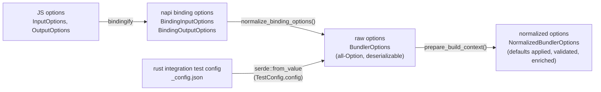

# 选项规范化

## 摘要

面向用户的选项并不是以一个共享结构体直接传入 bundler 核心，而是通过一个由不同类型组成的小型流水线进入。JS API 类型会先转换为 NAPI 绑定类型，绑定类型再降级为原始的 `BundlerOptions`，最后才将 `BundlerOptions` 规范化为核心实际消费的 `NormalizedBundlerOptions`。Rust 集成测试则完全跳过 JS 和 NAPI 层，直接从 `_config.json` fixture 反序列化出一个 `BundlerOptions`。

这个设计的关键在于 **在 `BundlerOptions` 处汇聚**：每个前端都生成同一个原始结构体，而单个函数（`prepare_build_context`）把这个原始结构体转换为规范化选项。因此，测试和生产环境共享同一套规范化实现，一个 fixture 就能执行到实际发布的默认值/校验逻辑。

## 分层

高层图里“所有输入都流向规范化选项”的那两条箭头并不会在 `NormalizedBundlerOptions` 处汇合。它们会在更早一层、也就是 `BundlerOptions` 处汇合，而单次 `prepare_build_context` 调用会为两者执行规范化。

| 层                     | 类型                                                                                            | 定义 / 转换位置                                                                                      |
| ---------------------- | ----------------------------------------------------------------------------------------------- | --------------------------------------------------------------------------------------------------- |
| JS options             | `InputOptions`, `OutputOptions`                                                                 | `packages/rolldown/src/options/input-options.ts`, `output-options.ts`                               |
| JS → binding           | `bindingifyInputOptions()`, `bindingifyOutputOptions()`                                         | `packages/rolldown/src/utils/bindingify-input-options.ts`, `bindingify-output-options.ts`           |
| napi binding options   | `BindingInputOptions`, `BindingOutputOptions`                                                   | `crates/rolldown_binding/src/options/binding_input_options/mod.rs`, `binding_output_options/mod.rs` |
| binding → raw          | `normalize_binding_options()` → `BundlerConfig { options: BundlerOptions, plugins }`            | `crates/rolldown_binding/src/utils/normalize_binding_options.rs:191`                                |
| raw options（汇聚点）   | `BundlerOptions`                                                                                | `crates/rolldown_common/src/inner_bundler_options/mod.rs:54`                                        |
| raw → normalized       | `prepare_build_context()` → `PrepareBuildContext { options: Arc<NormalizedBundlerOptions>, … }` | `crates/rolldown/src/utils/prepare_build_context.rs:163`                                            |
| normalized options     | `NormalizedBundlerOptions` (`SharedNormalizedBundlerOptions = Arc<…>`)                          | `crates/rolldown_common/src/inner_bundler_options/types/normalized_bundler_options.rs:42`           |

`Bundler::new(BundlerOptions)` 和 `BundleFactory::new` 都会流入 `prepare_build_context`（`bundle_factory.rs:68`），因此原始选项变为规范化选项的地方只有一个。

## 为什么需要每一层

### 为什么要有一个独立于 JS options 的 NAPI binding 层

`InputOptions`/`OutputOptions` 是面向 DX 的 API：它们接受 JS 函数（插件、`external` 谓词、`onLog`、sourcemap 转换）、嵌套对象以及联合类型语法糖。NAPI 无法原样承载这些形状，因此 `bindingify*` 会把它们降级为适合 FFI 的 `Binding*` 结构体——例如把 JS 回调包装成线程安全函数、将联合类型扁平化等等。绑定类型的形状由 FFI 约束决定，而不是由易用性决定。

### 为什么要有一个独立于 `NormalizedBundlerOptions` 的原始 `BundlerOptions`

`BundlerOptions` 是“原始、尚未解析”的结构体：几乎所有字段都是 `Option`，没有应用默认值，也没有执行跨字段校验。它有两个特性使其成为合适的汇聚点：

- 它**很容易从任何前端构造**——你只需要设置关心的字段，其余字段保持 `None`。
- 它**可被 `serde` 反序列化**（在 `deserialize_bundler_options` feature 下通过 `#[derive(Deserialize, JsonSchema)]`——`mod.rs:49-54`），因此可以直接从 JSON 构建，不需要 JS 运行时参与。

`NormalizedBundlerOptions` 则相反：每个字段都已解析、默认值已应用、选项已校验并补充，派生状态也已计算完成。核心只依赖这种形式。它自己的文档注释直接说明了这一点——原始选项“旨在为 `rolldown` 用户提供 DX 友好的选项，但不适合 `rolldown` 内部使用”（`normalized_bundler_options.rs:1-2`）。

`prepare_build_context` 就是弥合这道鸿沟的地方：它先运行 `verify_raw_options`（`prepare_build_context.rs:41`）来收集错误/警告，然后应用所有默认值和派生逻辑——基于格式的 `platform`、`process.env.NODE_ENV` define 注入、内建的 `module_types` 表、由 `file`/`dir` 推导的 `out_dir`、合并 tsconfig 的 transform 选项、minify 规范化等等。这个函数刻意写成了一大段映射逻辑（`#[expect(clippy::too_many_lines)]`）：把所有规范化集中在一个地方，才能保证每个前端得到完全一致的结果。

### 为什么 Rust 测试路径会绕过 JS/NAPI

这正是让 `BundlerOptions` 可反序列化的价值所在。测试 fixture 的 `_config.json` 会直接反序列化为与绑定层生成的同一结构体：`TestConfig.config` 本质上就是 `rolldown_common::BundlerOptions`（`crates/rolldown_testing_config/src/test_config.rs:8-10`，并且该 crate 的 `Cargo.toml:17` 开启了 `deserialize_bundler_options` feature）。fixture 运行器会读取配置（`fixture.rs:52-54` → `read_test_config`），对仍然是原始状态的 `BundlerOptions` 应用一层 **测试框架默认值**（`fixture.rs:56-58` 设置 `cwd`；`IntegrationTest::apply_test_defaults` 位于 `integration_test.rs:530`，在未设置时填充 `cwd`、`external`、`input`、`entry_filenames`、`chunk_filenames`、`checks` 等），然后才构造 `Bundler::new(options)`（`integration_test.rs:59-62`），而这一步会运行与生产环境**相同**的 `prepare_build_context`。

结果是：

- 集成测试在隔离状态下执行 Rust 核心——快速、声明式 JSON、无需 Node 进程——同时运行生产环境的规范化和校验逻辑。
- **默认值注意事项：**由于框架会在 `Bundler::new` 之前预先填充上面的字段，因此 fixture 中省略某个字段时，覆盖的是这些键的 _测试框架_ 默认值，而不是 `prepare_build_context` 里的生产默认值。只有被框架保持不变的字段，才会沿用生产默认值——编写选项规范化测试时请注意这一点。
- `_config.json` schema（`_config.schema.json`）由同一个结构体上的 `JsonSchema` derive 生成，因此 fixture 格式不可能偏离真实的选项集合。

第二个会生成 `BundlerOptions` 的前端（JSON 测试配置）就是一个明确证据：汇聚点是 `BundlerOptions`，而不是 NAPI 绑定。

## 未决问题

- `NormalizedBundlerOptions` 上的意图文档注释引用了 `crate::InputOptions`，但原始结构体的名字是 `BundlerOptions`（在 `rolldown_common` 中并不存在这样的别名）。这条注释最好改为指向 `BundlerOptions`，以避免混淆。

## 相关内容

- [cli](../cli/implementation.md) — CLI 参数解析；在此流水线开始前生成 JS `InputOptions`/`OutputOptions` 的上游阶段
- [rust-bundler](../rust-bundler/implementation.md) — `Bundler`/`BundleFactory`，它们持有最终的 `Arc<NormalizedBundlerOptions>`
- `crates/rolldown/src/utils/prepare_build_context.rs` — 唯一的 raw → normalized 规范化函数
- `crates/rolldown_binding/src/utils/normalize_binding_options.rs` — binding → raw 的降级转换
